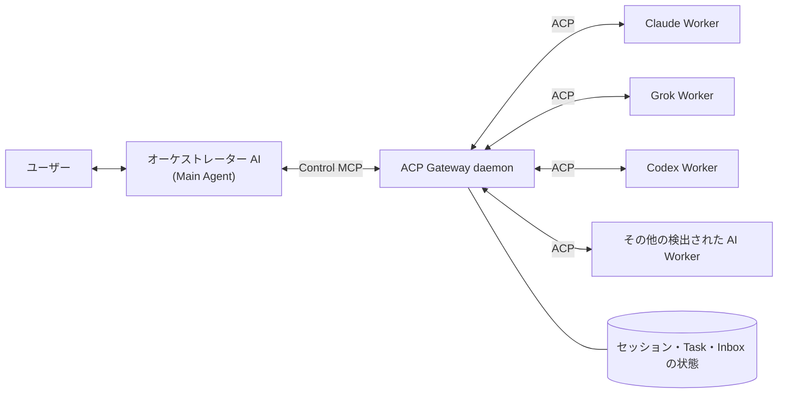

# ACP Gateway

[English](README.md) | [한국어](README.ko.md) | **日本語** | [简体中文](README.zh-CN.md)

**普段使っているコーディングエージェントから、必要に応じて Claude Code・Codex・Grok に作業を任せられます — MCP + ACP ベースで、セッションは保持され、権限リクエストは対話の中で承認でき、事前に決めておくワークフローも不要です。**

複数の AI エージェントを使っていませんか？

Claude に質問し、Codex にコードを直させ、Grok にレビューを頼む — ターミナルと会話を行ったり来たりして回していませんか？

「エージェントを一つひとつ自分で指揮するのではなく、一つのエージェントが他のエージェントを使いこなしてくれたらいいのに…」と思ったことはありませんか？

そんなあなたのために作りました。

## 概要

ACP Gateway は、ユーザーが直接対話する AI、つまり **オーケストレーター** が、ローカルにインストールされた複数の AI Worker を見つけて ACP で実行し、長時間タスクや権限リクエストから最終結果の取得まで管理できるようにするミドルウェアです。コードやツールの説明で使う `Main` は、このオーケストレーターの役割を指します。

- Claude Code、Codex、Grok を組み込みの Worker としてサポートし、ローカルにインストールされたその他の ACP 対応 AI は、ACP 公式レジストリと照合して検出します。
- daemon が ACP セッションと provider プロセスを維持し続けます。
- MCP が再起動しても、Worker セッションを復旧できます。
- モデル、権限、質問、キャンセル、結果の収集をオーケストレーターが制御します。
- Gateway は Worker の環境から自身のトークン、ソケット、Main の識別子を取り除きます。ただし、Gateway を経由せずにファイルを読む Worker はトークンを見つけられます。詳しくは[権限ポリシー](#権限ポリシー)を参照してください。
- ローカルの単一ユーザー・単一マシンでの利用を前提としています。

## クイックスタート

### 必要要件

Node.js 22 以上と、macOS または Linux が必要です。

### インストール

npm で Gateway をインストールしてから、bootstrap でこのマシンのエージェントに組み込みます。

```bash
npm install -g acp-gateway-daemon
acp-gateway-bootstrap --install-all --refresh-registry --dry-run
acp-gateway-bootstrap --install-all --refresh-registry
```

Claude Worker はインストール済みの Claude CLI を使い、`CLAUDE_CODE_EXECUTABLE` が空でなければそのパスを、なければ daemon の PATH のうち絶対パスのディレクトリで最初に見つかった `claude` (Gateway 自身の依存パッケージ内のものと、Claude Agent SDK に同梱されたバイナリは除く) を、それもなければ `~/.local/bin/claude` を使い、どれもなければ Claude は未インストールと報告されます。

最後の 2 つのコマンドのうち、1 つ目はインストール計画だけを確認する dry-run で、2 つ目が実際のインストールです。`--install-all` は ACP 公式レジストリが指定する `npx`・`uvx` パッケージをグローバルにインストールまたは更新することがあるため、まず dry-run の結果で対象とバージョンを確認してください。レジストリの manifest は ACP が管理していますが、実際のパッケージとバイナリは各提供元の配布元からダウンロードされます。インストールがマシンに加える変更は、[インストールがマシンに加える変更](#インストールがマシンに加える変更)にまとめています。

デフォルトの `--install-all` は、Codex・Claude・Grok のうちどのエージェントをユーザーとの対話用の **フロントドア** にするかを質問します。選んだ 1 つにだけオーケストレーター用の Control MCP を登録し、検出されたすべてのエージェントには読み取り専用の Guide MCP とスキルをインストールします。非対話のインストールでは Codex がデフォルトで、次のように明示できます。

```bash
acp-gateway-bootstrap --install-all --front-door codex
acp-gateway-bootstrap --install-all --front-door claude
acp-gateway-bootstrap --install-all --front-door grok
```

#### ソースからインストール

コードを変更したいときなど、Git のチェックアウトから直接動かす場合は、リポジトリをクローンしてリンクします。

```bash
git clone https://github.com/creverse-ai-lab/agent_gateway.git
cd agent_gateway
npm ci
npm link
acp-gateway-bootstrap --install-all --refresh-registry --dry-run
acp-gateway-bootstrap --install-all --refresh-registry
```

`npm link` を実行すると、同じコマンドが PATH から使えるようになり、チェックアウトから直接実行されます。最後の 2 つのコマンドとフロントドアの選択は、上と同じです。

### 最初の委任

インストーラーは、検出された AI に `agent-delegator` スキルも一緒にインストールします。このスキルは、ユーザーの依頼から Worker・モデル・権限の範囲を読み取り、Gateway セッションの作成、作業の受け渡し、進捗の確認、質問・権限リクエストの処理、結果の取得まで案内します。インストール後は MCP ツール名を覚える必要はなく、オーケストレーターに自然な言葉で作業を頼むだけです。

たとえば、対話中のオーケストレーター AI に次のように頼めます。

```text
Claude Sonnet に、このリポジトリの認証コードを読み取り専用でレビューさせて、結果をまとめて。

Grok 4.5 に、現在の設計のセキュリティ上の弱点を red-team レビューさせて、権限リクエストは私に確認して。
```

内部では次の順序で動作します。

1. `agent_acp_setup` で provider を確認
2. `agent_acp_session_open` で Worker セッションを作成
3. 必要に応じて `agent_acp_config` で、Worker が対応するモデル・モード・推論レベルなどのパラメーターを取得・設定
4. `agent_acp_prompt` で作業を渡す
5. `agent_acp_poll` でイベントと状態を確認
6. 必要に応じて `agent_acp_permission` または `agent_acp_answer` で応答
7. 完了後はセッションを再利用するか、`agent_acp_session` で終了

標準で提供される `agent-delegator` は、汎用的に使うための出発点です。よく使う Worker、デフォルトのモデル、権限ポリシー、レビューの順序や結果の形式があれば、インストールされたスキルを自分の作業スタイルに合わせて編集できます。`acp-gateway-bootstrap --update` と通常の `--update-skill` は、ユーザーが編集したコピーを上書きしません。インストールされている Gateway に同梱の標準版に戻したいときだけ、`--update-skill --force` を明示的に実行してください。

### 権限ポリシー

セッションを開くときに、次のポリシーのいずれかを選びます。

| ポリシー | 用途 |
|---|---|
| `read_only` | 分析、レビュー、読み取り専用の作業 |
| `ask` | ファイルの変更やコマンドの実行の前に、オーケストレーターの承認が必要 |
| `auto_approve` | ユーザーが許可したセッションの境界内で自動承認 |

Control token、オーケストレーターの識別子 (Main ID)、Gateway のソケットパスは ACP Worker の環境から取り除かれ、Worker セッションに Control MCP を再び注入することもブロックされます。ただし、これですべての Worker からトークンを守れるわけではありません。自身のツールで Gateway を経由せずにファイルを読む Worker (Codex は `read_only` でもそうすることを確認しています) は、フロントドアの MCP 設定に保存された Control token を読み取り、Main として振る舞えます。そのため、このような Worker には信頼できないコンテンツ (プロンプトインジェクションが潜んでいるかもしれないリポジトリ、ドキュメント、Web ページ) を渡さず、そうした作業には Gateway がファイルの読み取りを仲介するか、サンドボックスで制限する provider を使ってください。セッションで Gateway が強制できない項目は `permission_policy_partial` アラートに表示されます。より強い隔離は今後のリリースで提供する予定です。

### 更新

更新の方法は、Gateway をどのようにインストールしたかによって異なります。

**npm でインストールした場合** — 新しいリリースをインストールしてから、登録情報を更新して daemon を再起動します。

```bash
npm install -g acp-gateway-daemon@latest
acp-gateway-bootstrap --update
```

npm でインストールした場合、`--update` が Git や npm を自ら実行することはありません。ACP レジストリ、adapter、MCP の登録を更新し、npm がインストールしたバージョンで daemon を再起動します。npm に新しいリリースが出ると、Gateway がヘルスチェックの通知でも知らせます。

**ソースからインストールした場合** — 次のコマンドを 1 つ実行するだけです。

```bash
acp-gateway-bootstrap --update
```

**アプリが管理するランタイム** — デスクトップアプリが Gateway をインストールした場合 (`~/.acp-gateway/runtime/versions/` の下)、更新もそのアプリが行います。このとき `acp-gateway-bootstrap --update` は Gateway のファイルには触れず、登録情報だけを更新します。

更新後は、ホスト (Claude/Codex/Grok/Auggie) のセッションを再接続すると、新しいツールと引数が見えるようになります。動作の詳細、スキルの更新、再接続の手順は[運用ガイド](docs/operations.md)(英語)を参照してください。

## 仕組み



オーケストレーターは MCP を通じて作業を指示し、Gateway は各 Worker と ACP で通信します。Gateway daemon は Unix ソケット、ACP 接続、セッション、イベント、権限リクエストと最小限の復旧状態を管理するため、オーケストレーターや MCP 接続が再起動しても、進行中の Worker を引き続き制御できます。

### 作業パイプライン

1. **検出・インストール** — インストーラーがローカルの AI を探し、ACP 公式レジストリから対応する agent と adapter を用意します。
2. **タスク作成** — オーケストレーターが Control MCP で provider、モデル、作業パス、権限ポリシーを指定してセッションを開きます。
3. **Worker の実行** — Gateway が該当する provider のプロセスを起動するか、既存のプロセス・セッションを再利用します。
4. **ACP による作業の受け渡し** — prompt、ファイル操作、tool event、途中結果が ACP を通じてやり取りされます。
5. **権限・質問の処理** — Worker の権限リクエストや質問は Gateway Inbox を経由してオーケストレーターに届き、その応答が Worker に戻ります。
6. **結果の取得・再利用** — オーケストレーターは MCP Task または poll で状態と結果を受け取り、必要なら同じセッションを再び呼び出したり復旧したりします。

### 信頼性

Gateway は委任した作業の状況も伝えるため、再起動の後や Worker が長く沈黙しているときに、オーケストレーターが推測する必要はありません。

- **セッションがその状態にある理由** — 状態が変わるたびに理由と時刻を記録します。実行中の Worker がしばらく（デフォルト 5 分）何も送ってこない場合は、停止の疑いとして印を付けます。これはヒントにすぎず、何もキャンセルしません。
- **中断で分からなくなったこと** — 再起動や Worker の喪失で打ち切られたタスクは、Worker がすでに prompt に基づいて動いた可能性があるかどうかと、次に取るべき手順を示します。`agent_acp_session {action: "check"}` は何も起動せず読み取りだけで、セッションを復旧できるかどうかを報告します。
- **attention inbox** — `agent_acp_inbox {action: "attention"}` は、オーケストレーターを待っているリクエストと、まだ受け取っていない完了結果を一覧にします。`ack` で確認済みにできます。
- **タスク間の関係の宣言** — run は、引き継ぐタスク（`parentTaskId`）と結果を利用したタスク（`inputTaskIds`）を明示できます。`scope: "mine"` を指定すると、セッションとタスクの一覧には呼び出したオーケストレーター自身の作業だけが表示されます。
- **復旧の連続失敗による隔離** — 復旧が続けて失敗すると（デフォルト 3 回）、Gateway はそのセッションを自動で復旧するのをやめ、残りの選択肢とともに `SESSION_QUARANTINED` を返します。明示的な復旧に成功すると隔離は解除されます。

## ACP と MCP とは？

[ACP (Agent Client Protocol)](https://agentclientprotocol.com/) は、コードエディター・IDE と AI コーディングエージェントの間の通信を標準化するプロトコルです。エディターごとに Claude、Codex、Grok のようなエージェントを個別に統合する代わりに、ACP という共通仕様で、セッションの作成、prompt の送信、tool 呼び出し、権限リクエスト、進捗イベント、結果をやり取りします。

ACP の仕様では、ローカルの agent は通常 JSON-RPC over stdio で起動され、リモートの agent は HTTP または WebSocket 接続を使えます。 **現在の ACP Gateway の実装範囲は、ローカル単一マシン上の ACP agent との Unix ソケット通信です。** リモート agent への接続はまだサポートしていません。

- **ACP** は、エージェント自体を起動して対話し、作業状態を管理するための仕様です。
- **MCP (Model Context Protocol)** は、AI が外部のツール、データ、アプリケーションとつながるための共通インターフェースです。
- **ACP Gateway** は、内部では ACP で Worker を管理し、オーケストレーターにはその制御機能を MCP ツールとして提供します。

つまり、MCP と ACP のどちらかを選ぶ構造ではありません。MCP はオーケストレーターが Gateway を操作する入口であり、ACP は Gateway が他の AI エージェントと実際に作業する通信路です。

現時点の最新仕様は [MCP 2026-07-28](https://modelcontextprotocol.io/specification/2026-07-28) です。ACP Gateway はこの仕様全体を実装しているとは主張せず、そのうち、長時間の作業を task handle として開始し、状態と結果を後から再取得する **MCP Tasks extension の流れ** をサポートしています。現在のローカル stdio MCP サーバーには、stateless HTTP core や OAuth/OIDC 認証は適用されていません。MCP 2026-07-28 の変更点の全体は、[MCP 公式仕様](https://modelcontextprotocol.io/specification/2026-07-28)と [Anthropic による紹介](https://claude.com/blog/bringing-mcp-2026-07-28-to-claude)を参照してください。

## Agent CLI の直接利用や単純な MCP 呼び出しとの違いは？

ここでいう **Agent CLI の直接利用** とは、人がターミナルを行き来して操作する場合ではなく、ユーザーが対話中のオーケストレーターが shell tool で `claude`、`grok` のような他の AI CLI プロセスを起動し、stdout の結果を受け取る方式を指します。 **単純な MCP 呼び出し** は、その CLI の実行を MCP tool 1 つで包んだ、一般的なラッパー方式です。

`O` は通常の基本的な使い方で対応していることを、`X` は別途 daemon、セッションストア、または双方向プロトコルを自分で実装する必要があることを意味します。CLI や MCP プロトコル自体の理論上の限界を意味するものではありません。

| 機能 | Agent CLI の直接利用 | 単純な MCP ラッパー | ACP Gateway | 実際の違い |
|---|:---:|:---:|:---:|---|
| 他の AI の実行 | O | O | O | 3 つの方式のいずれも Worker を呼び出せる |
| provider・モデルの選択 | O | O | O | CLI は agent ごとの flag、Gateway は共通の入力を使用 |
| 同じセッションへのフォローアップ | O | X | O | CLI では resume ID をオーケストレーターが自分で管理、Gateway は session ID で管理 |
| Worker 組み込みのサブエージェントの利用 | O | O | O | prompt で依頼できるが、Gateway は child event まで取得 |
| 複数 Worker の同時実行 | O | O | O | CLI・ラッパーでは呼び出しの関係をオーケストレーターが自分で管理 |
| 接続から切り離された長時間作業 | X | X | O | Gateway は MCP Task handle で後から再照会できる |
| 進捗 event の照会・再生 | X | X | O | Gateway は cursor 以降の新しい event だけを再照会できる |
| Worker の権限リクエストへの応答 | X | X | O | Gateway がリクエストを Inbox に保持し、オーケストレーターの承認・拒否を伝える |
| Worker の途中の質問への応答 | X | X | O | 単発の呼び出しでは同じ実行の流れで答えにくく、Gateway は elicitation で往復する |
| Worker プロセスまで状態を確定するキャンセル | X | X | O | Gateway が ACP cancel と子プロセスの終了をあわせて管理 |
| オーケストレーター・MCP の再起動後の作業への再接続 | X | X | O | 別の daemon が Worker とセッションを維持 |
| 重複のない差分での結果取得 | X | X | O | cursor と `includeResult` で必要なデータだけ取得 |
| 放置されたセッションの自動整理 | X | X | O | idle unload と retention GC を適用 |
| 構造化された失敗診断・復旧状態 | X | X | O | event、task の状態、checkpoint を分けて確認 |

## インストールがマシンに加える変更

パッケージのインストールと `acp-gateway-bootstrap --install-all` が実際に変更するものは次のとおりです。`--dry-run` を付けると、bootstrap は実際の変更を行わず計画だけを出力します。

- **Gateway パッケージ (npm でのインストール)** — `npm install -g` は、npm のグローバル prefix の下にパッケージをインストールします。ファイルは `$(npm root -g)/acp-gateway-daemon` に、`acp-gateway-*` コマンドは `$(npm prefix -g)/bin` に置かれ、以下で登録する MCP サーバーもここから実行されます。ソースからインストールした場合は、`npm link` がチェックアウトを同じ場所にリンクします。
- **ACP agent/adapter のインストール** — PATH、一般的な CLI のパス、グローバル npm パッケージからインストール済みの AI を探し、ACP 公式レジストリと照合して、レジストリが指定する `npx`・`uvx` パッケージをグローバルにインストールまたは更新します (`npm install --global` または `uv tool install --force`)。レジストリに登録されていない AI は自動では登録しません。
- **MCP の登録** — 各 CLI の `mcp add` コマンド (Auggie は `mcp add-json`) で MCP サーバーを 2 つ登録します。オーケストレーター専用の Control MCP `agent-acp` は、フロントドアとして選んだ CLI 1 つにだけ (`--front-door`。非対話のインストールでは Codex)、読み取り専用の Guide MCP `agent-acp-guide` は、検出されたサポート対象の CLI (Codex、Claude、Grok、Auggie) に登録します。Control MCP を登録するとき、Control token と Main ID がサーバーの実行環境変数 (`ACP_GATEWAY_CONTROL_TOKEN`、`ACP_GATEWAY_ROOT_ID`) として一緒に渡されるため、Control MCP は信頼できるローカルの agent にだけインストールしてください。インストーラーが作成していない同名のエントリがすでにある場合は、`--force` なしでは上書きせず、エラーで中断します。
- **`agent-delegator` スキルのインストール** — Gateway に同梱されたスキルを、検出された AI それぞれの skills ディレクトリにコピーします。

  | AI | インストール先 | パスを変更する環境変数 |
  |---|---|---|
  | Codex | `~/.codex/skills` | `CODEX_HOME` (設定すると `$CODEX_HOME/skills`) |
  | Claude | `~/.claude/skills` | `CLAUDE_HOME` (設定すると `$CLAUDE_HOME/skills`) |
  | Grok | `~/.grok/skills` | `GROK_HOME` (設定すると `$GROK_HOME/skills`) |
  | Auggie | `~/.augment/skills` | `AUGMENT_HOME` (設定すると `$AUGMENT_HOME/skills`) |
  | その他のレジストリ provider | `~/.agents/skills` | なし |

  同じパスを使う provider が複数ある場合、スキルのファイルは 1 回だけコピーします。スキルは最初の `--install-all` でだけインストールされ、`--update` は触れません。インストーラーが管理していない同名のスキルがすでにある場合は、`--force` なしでは上書きせず、エラーで中断します。
- **状態ファイル `~/.acp-gateway/`** — 次のファイルを作成します。
  - `install.json` (権限 `0600`): Control token、Main ID、インストーラーが登録した MCP・スキルの記録、ACP agent の自動更新・通知の設定
  - `registry.json`: ACP 公式レジストリの 24 時間キャッシュ
  - `providers.json`: 検出された provider の実行定義

  daemon が起動すると、同じディレクトリにセッション状態 (`state.snapshot.json`、`state.wal.ndjson`) と `artifacts` ディレクトリも作られます。
- **daemon の起動** — インストール後、ヘルスチェックで Gateway daemon を起動して認証状態を確認し、実行中の daemon のバージョンが異なる場合は新しいバージョンに置き換えます。`--skip-health-check` でこの手順を省略できます。

Gateway 本体は、自分で更新したときにだけ変わります。npm でのインストールは `npm install -g` で、ソースのチェックアウトは `acp-gateway-bootstrap --update` で、アプリが管理するランタイムはそのアプリで更新します。インストーラーにアンインストールのコマンドはないため、元に戻すには上記の項目を自分で削除する必要があります。npm パッケージは `npm uninstall -g acp-gateway-daemon` で削除できます。

## ドキュメント

- [管理 API 契約](docs/management-api.md)(英語) — エンジン設定、provider ポリシー、安全なシャットダウン、公開クライアントの契約 (`acp-gateway-daemon/client`。アプリがマウントしたランタイムでは `acp-gateway/client`)
- [Live use cases](docs/live-usecases.md)(韓国語) — 実際の Claude・Codex・Grok Worker で動かしたユースケースの記録
- [運用ガイド](docs/operations.md)(英語) — インストーラーのオプション、更新、ホストの再接続、Worker パラメーターの制御、セッションとデータの管理
- [変更履歴](CHANGELOG.md)(英語) — バージョンごとの変更点

## ライセンス

Apache License 2.0 — 詳細は [LICENSE](LICENSE) を参照してください。

---

Dev by 윤치영
