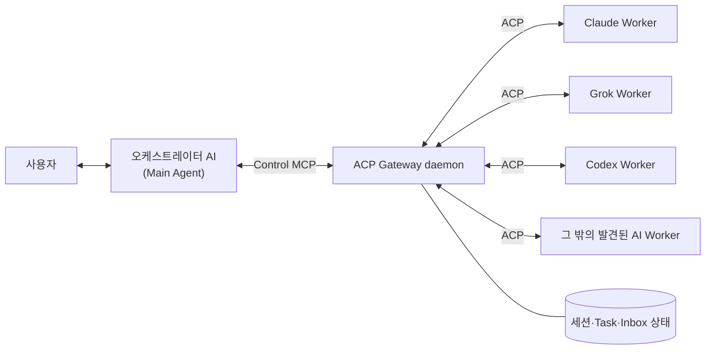

# ACP Gateway

**한국어** | [English](README.md) | [日本語](README.ja.md) | [简体中文](README.zh-CN.md)

**지금 쓰는 코딩 에이전트가 필요할 때 Claude Code, Codex, Grok에게 일을 나눠 맡길 수 있게 해주는 로컬 관제실 — MCP + ACP 기반으로 세션이 유지되고, 권한 요청은 대화로 승인하며, 미리 정해 둔 워크플로도 필요 없습니다.**

혹시 여러 AI 에이전트를 쓰고 계신가요?

Claude에게 물어봤다가, Codex로 코드를 고치고, Grok에게 다시 리뷰를 맡기느라 터미널과 대화를 계속 돌려막고 계신가요?

“내가 이 에이전트들을 일일이 지휘하지 말고, 한 에이전트가 다른 에이전트를 알아서 활용하면 좋을 텐데…”라고 생각해 본 적이 있으신가요?

그런 당신을 위해 준비했습니다.

## 개요

ACP Gateway는 사용자가 직접 대화하는 AI, 즉 **오케스트레이터**가 로컬에 설치된 여러 AI Worker를 발견하고 ACP로 실행하며, 장기 작업과 권한 요청부터 최종 결과 회수까지 관리할 수 있게 해주는 미들웨어입니다. 코드와 도구 설명에서 사용하는 `Main`은 이 오케스트레이터 역할을 뜻합니다.

- Claude Code, Codex, Grok을 기본 Worker로 지원하며, 로컬에 설치된 그 밖의 ACP 지원 AI는 ACP 공식 registry와 대조해 발견합니다.
- ACP 세션과 provider 프로세스를 daemon이 계속 유지합니다.
- MCP가 재시작되어도 Worker 세션을 복구할 수 있습니다.
- 모델, 권한, 질문, 취소, 결과 수집을 오케스트레이터가 통제합니다.
- Worker에는 Gateway 제어 권한을 전달하지 않습니다.
- 로컬 단일 사용자·단일 머신 사용을 기준으로 합니다.

## 빠른 시작

### 요구 사항

Node.js 22 이상과 macOS 또는 Linux가 필요합니다.

### 설치

npm으로 Gateway를 설치한 뒤, bootstrap으로 이 컴퓨터의 agent에 연결합니다.

```bash
npm install -g acp-gateway-daemon
acp-gateway-bootstrap --install-all --refresh-registry --dry-run
acp-gateway-bootstrap --install-all --refresh-registry
```

Claude Worker는 이미 설치된 Claude CLI를 사용하며, `CLAUDE_CODE_EXECUTABLE`이 비어 있지 않으면 그 경로를, 아니면 daemon의 PATH 중 절대 경로 디렉터리에서 처음 찾은 `claude`(Gateway 자신의 의존성 안에 있는 것과 Claude Agent SDK에 딸린 바이너리는 제외)를, 그것도 없으면 `~/.local/bin/claude`를 쓰고, 모두 없으면 Claude를 설치되지 않은 것으로 보고합니다.

마지막 두 명령 중 첫 번째는 설치 계획만 확인하는 dry-run이고, 두 번째가 실제 설치입니다. `--install-all`은 ACP 공식 registry가 지정한 `npx`·`uvx` 패키지를 전역으로 설치하거나 갱신할 수 있으므로 dry-run 결과에서 대상과 버전을 먼저 확인하세요. Registry manifest는 ACP가 관리하지만 실제 package와 binary는 각 공급자의 배포처에서 내려받습니다. 설치가 내 환경에서 무엇을 바꾸는지는 [설치가 내 환경에 바꾸는 것](#설치가-내-환경에-바꾸는-것)에 정리했습니다.

기본 `--install-all`은 Codex, Claude, Grok 중 어느 agent를 사용자 대화용 **프론트 도어**로 사용할지 질문합니다. 선택한 하나에만 오케스트레이터용 Control MCP를 등록하고, 발견된 agent 전체에는 읽기 전용 Guide MCP와 skill을 설치합니다. 비대화형 설치에서는 Codex가 기본값이며 다음처럼 명시할 수 있습니다.

```bash
acp-gateway-bootstrap --install-all --front-door codex
acp-gateway-bootstrap --install-all --front-door claude
acp-gateway-bootstrap --install-all --front-door grok
```

#### 소스에서 설치

코드를 고치려는 경우처럼 Git checkout에서 바로 실행하려면 저장소를 받아 연결합니다.

```bash
git clone https://github.com/creverse-ai-lab/agent_gateway.git
cd agent_gateway
npm ci
npm link
acp-gateway-bootstrap --install-all --refresh-registry --dry-run
acp-gateway-bootstrap --install-all --refresh-registry
```

`npm link`를 하면 같은 명령을 PATH에서 쓸 수 있고, 명령은 checkout에서 바로 실행됩니다. 마지막 두 명령과 프론트 도어 선택은 위와 같습니다.

### 첫 위임

Installer는 발견된 AI에 `agent-delegator` skill을 함께 설치합니다. 이 skill은 사용자의 요청에서 Worker, 모델과 권한 범위를 파악하고, Gateway 세션 생성부터 작업 전달, 진행 확인, 질문·권한 처리와 결과 회수까지 안내합니다. 설치 후에는 MCP 도구 이름을 외울 필요 없이 오케스트레이터에게 자연어로 작업을 요청하면 됩니다.

예를 들어 사용자가 대화 중인 오케스트레이터 AI에 다음처럼 요청할 수 있습니다.

```text
Claude Sonnet에게 이 저장소의 인증 코드를 읽기 전용으로 검토시키고 결과를 정리해줘.

Grok 4.5에게 현재 설계의 보안 취약점을 red-team 검토시키고, permission 요청은 나에게 확인해줘.
```

내부적으로는 다음 순서로 동작합니다.

1. `agent_acp_setup`으로 provider 확인
2. `agent_acp_session_open`으로 Worker 세션 생성
3. 필요한 경우 `agent_acp_config`로 Worker가 지원하는 모델·모드·추론 수준 등의 파라미터 조회·설정
4. `agent_acp_prompt`로 작업 전달
5. `agent_acp_poll`로 이벤트와 상태 확인
6. 필요한 경우 `agent_acp_permission` 또는 `agent_acp_answer`로 응답
7. 완료 후 세션을 재사용하거나 `agent_acp_session`으로 종료

기본 제공되는 `agent-delegator`는 범용 사용을 위한 시작점입니다. 자주 사용하는 Worker, 기본 모델, 권한 정책, 리뷰 순서나 결과 형식이 있다면 설치된 skill을 사용자 작업 방식에 맞게 수정해 사용할 수 있습니다. `acp-gateway-bootstrap --update`와 일반 `--update-skill`은 사용자 수정본을 덮어쓰지 않습니다. 설치된 Gateway에 들어 있는 기본본으로 되돌리고 싶을 때만 `--update-skill --force`를 명시적으로 실행하세요.

### 권한 정책

세션을 열 때 다음 정책 중 하나를 선택합니다.

| 정책 | 용도 |
|---|---|
| `read_only` | 분석, 검토, 읽기 전용 작업 |
| `ask` | 파일 변경이나 명령 실행 전에 오케스트레이터 승인 필요 |
| `auto_approve` | 사용자가 허용한 세션 경계 안에서 자동 승인 |

Control token, 오케스트레이터 식별자(Main ID)와 Gateway socket 경로는 ACP Worker 환경에서 제거됩니다. Worker 세션에 Control MCP를 다시 주입하는 것도 차단합니다.

### 업데이트

업데이트 방법은 Gateway를 어떻게 설치했는지에 따라 다릅니다.

**npm으로 설치한 경우** — 새 버전을 설치한 다음, 등록 정보를 갱신하고 daemon을 다시 시작합니다.

```bash
npm install -g acp-gateway-daemon@latest
acp-gateway-bootstrap --update
```

npm 설치본에서는 `--update`가 Git이나 npm을 직접 실행하지 않습니다. ACP registry, adapter, MCP 등록을 갱신하고, npm이 설치한 버전으로 daemon을 다시 시작합니다. npm에 새 버전이 나오면 Gateway가 health check 알림으로도 알려 줍니다.

**소스에서 설치한 경우** — 다음 명령 하나만 실행합니다.

```bash
acp-gateway-bootstrap --update
```

**앱이 관리하는 runtime** — 데스크톱 앱이 Gateway를 설치했다면(`~/.acp-gateway/runtime/versions/` 아래) 업데이트도 그 앱이 맡습니다. 이때 `acp-gateway-bootstrap --update`는 Gateway 파일은 건드리지 않고 등록 정보만 갱신합니다.

갱신한 뒤에는 호스트(Claude/Codex/Grok/Auggie) 세션을 다시 연결해야 새 tool과 인자가 보입니다. 자세한 동작과 skill 갱신, 호스트 재연결 절차는 [운영 가이드](docs/operations.ko.md)를 참고하세요.

## 동작 방식



오케스트레이터는 MCP를 통해 작업을 지시하고, Gateway는 각 Worker와 ACP로 통신합니다. Gateway daemon은 Unix socket, ACP 연결, 세션, 이벤트, permission 요청과 최소 복구 상태를 관리하므로 오케스트레이터나 MCP 연결이 다시 시작되어도 진행 중인 Worker를 이어서 제어할 수 있습니다.

### 작업 파이프라인

1. **발견·설치** — installer가 로컬 AI를 찾고 ACP 공식 registry에서 대응 agent와 adapter를 준비합니다.
2. **작업 생성** — 오케스트레이터가 Control MCP로 provider, 모델, 작업 경로와 권한 정책을 지정해 세션을 엽니다.
3. **Worker 실행** — Gateway가 해당 provider 프로세스를 시작하거나 기존 프로세스·세션을 재사용합니다.
4. **ACP 작업 전달** — prompt, 파일 작업, tool event와 중간 결과가 ACP를 통해 오갑니다.
5. **권한·질문 처리** — Worker의 permission 요청이나 질문은 Gateway Inbox를 거쳐 오케스트레이터에게 전달되고, 그 응답이 다시 Worker로 돌아갑니다.
6. **결과 회수·재사용** — 오케스트레이터는 MCP Task 또는 poll로 상태와 결과를 받고, 필요하면 같은 세션을 다시 호출하거나 복구합니다.

### 신뢰성

Gateway는 맡긴 작업이 어디까지 왔는지도 알려 주므로, 재시작 뒤나 Worker가 오래 조용할 때 오케스트레이터가 짐작할 필요가 없습니다.

- **세션이 그 상태인 이유** — 상태가 바뀔 때마다 이유와 시각을 기록합니다. 실행 중인 Worker가 한동안(기본 5분) 아무것도 보내지 않으면 멈춤 의심으로 표시합니다. 힌트일 뿐이며 아무것도 취소하지 않습니다.
- **중단으로 모르게 된 것** — 재시작이나 Worker 유실로 끊긴 작업은 Worker가 이미 prompt를 받아 움직였을 수 있는지와 다음에 할 일을 알려 줍니다. `agent_acp_session {action: "check"}`는 아무것도 띄우지 않고 읽기만 해서 세션을 되살릴 수 있는지 알려 줍니다.
- **attention inbox** — `agent_acp_inbox {action: "attention"}`은 오케스트레이터를 기다리는 요청과 아직 받지 못한 완료 결과를 모아 보여 줍니다. `ack`로 확인한 것으로 표시할 수 있습니다.
- **작업 연결 선언** — run은 이어받는 작업(`parentTaskId`)과 결과를 활용한 작업(`inputTaskIds`)을 밝힐 수 있습니다. `scope: "mine"`을 주면 세션·작업 목록에 호출한 오케스트레이터의 작업만 나옵니다.
- **복구가 거듭 실패한 세션 격리** — 복구가 연달아 실패하면(기본 3회) Gateway가 더 이상 알아서 복구하지 않고, 남은 선택지와 함께 `SESSION_QUARANTINED`를 돌려줍니다. 명시적 복구에 성공하면 격리가 풀립니다.

## ACP와 MCP란?

[ACP(Agent Client Protocol)](https://agentclientprotocol.com/)는 코드 에디터·IDE와 AI 코딩 에이전트 사이의 통신을 표준화하는 프로토콜입니다. 에디터마다 Claude, Codex, Grok 같은 에이전트를 별도로 통합하는 대신, ACP라는 공통 규격으로 세션 생성, prompt 전달, tool 호출, 권한 요청, 진행 이벤트와 결과를 주고받습니다.

ACP 규격에서 로컬 agent는 일반적으로 JSON-RPC over stdio로 실행되며, 원격 agent는 HTTP 또는 WebSocket 연결을 사용할 수 있습니다. **현재 ACP Gateway 구현 범위는 로컬 단일 머신의 ACP agent와 Unix socket 통신입니다.** 원격 agent 연결은 아직 지원하지 않습니다.

- **ACP**는 에이전트 자체를 실행하고 대화하며 작업 상태를 관리하는 규격입니다.
- **MCP(Model Context Protocol)**는 AI가 외부 도구, 데이터, 애플리케이션과 연결되는 공통 인터페이스입니다.
- **ACP Gateway**는 내부에서 ACP로 Worker를 관리하고, 오케스트레이터에는 MCP 도구로 그 제어 기능을 제공합니다.

즉, MCP와 ACP 중 하나를 고르는 구조가 아닙니다. MCP는 오케스트레이터가 Gateway를 조작하는 입구이고, ACP는 Gateway가 다른 AI 에이전트와 실제로 작업하는 통신로입니다.

현재 최신 명세는 [MCP 2026-07-28](https://modelcontextprotocol.io/specification/2026-07-28)입니다. ACP Gateway는 이 명세 전체를 구현한다고 주장하지 않으며, 그중 장시간 작업을 task handle로 시작하고 상태·결과를 다시 조회하는 **MCP Tasks extension 흐름**을 지원합니다. 현재 로컬 stdio MCP 서버에는 stateless HTTP core나 OAuth/OIDC 인증이 적용되지 않습니다. MCP 2026-07-28의 전체 변경 사항은 [MCP 공식 명세](https://modelcontextprotocol.io/specification/2026-07-28)와 [Anthropic의 소개](https://claude.com/blog/bringing-mcp-2026-07-28-to-claude)를 참고하세요.

## Agent CLI 직접 활용·단순 MCP 호출과 무엇이 다른가요?

여기서 **Agent CLI 직접 활용**은 사람이 터미널을 번갈아 조작하는 경우가 아니라, 사용자가 대화 중인 오케스트레이터가 shell tool로 `claude`, `grok` 같은 다른 AI CLI 프로세스를 실행하고 stdout 결과를 받는 방식을 뜻합니다. **단순 MCP 호출**은 그 CLI 실행을 MCP tool 하나로 감싼 일반적인 wrapper 방식입니다.

`O`는 일반적인 기본 사용 흐름에서 지원한다는 뜻이고, `X`는 별도의 daemon, session 저장소 또는 양방향 protocol을 직접 구현해야 한다는 뜻입니다. CLI나 MCP protocol 자체의 이론적 한계를 의미하지는 않습니다.

| 기능 | Agent CLI 직접 활용 | 단순 MCP wrapper | ACP Gateway | 실제 차이 |
|---|:---:|:---:|:---:|---|
| 다른 AI 실행 | O | O | O | 세 방식 모두 Worker를 호출할 수 있음 |
| provider·model 선택 | O | O | O | CLI는 agent별 flag, Gateway는 공통 입력 사용 |
| 같은 session에 후속 피드백 | O | X | O | CLI는 resume ID를 오케스트레이터가 직접 관리, Gateway는 session ID로 관리 |
| Worker의 built-in 서브에이전트 사용 | O | O | O | prompt로 요청 가능하지만 Gateway는 child event까지 회수 |
| 여러 Worker 동시 실행 | O | O | O | CLI·wrapper는 호출 관계를 오케스트레이터가 직접 관리 |
| 연결과 분리된 장시간 작업 | X | X | O | Gateway는 MCP Task handle로 나중에 다시 조회 가능 |
| 진행 event 조회·재생 | X | X | O | Gateway는 cursor 이후의 새 event만 다시 조회 가능 |
| Worker permission 요청에 응답 | X | X | O | Gateway가 요청을 Inbox에 보존하고 오케스트레이터의 승인·거부를 전달 |
| Worker의 중간 질문에 응답 | X | X | O | 단발 호출은 같은 실행 흐름으로 답하기 어렵고 Gateway는 elicitation으로 왕복 |
| Worker process까지 상태를 확정하며 취소 | X | X | O | Gateway가 ACP cancel과 하위 process 종료를 함께 관리 |
| 오케스트레이터·MCP 재시작 후 작업 재연결 | X | X | O | 별도 daemon이 Worker와 session을 유지 |
| 중복 없는 증분 결과 회수 | X | X | O | cursor와 `includeResult`로 필요한 데이터만 회수 |
| 방치 session 자동 정리 | X | X | O | idle unload와 retention GC 적용 |
| 구조화된 실패 진단·복구 상태 | X | X | O | event, task 상태와 checkpoint를 분리해 확인 |

## 설치가 내 환경에 바꾸는 것

패키지 설치와 `acp-gateway-bootstrap --install-all`이 실제로 바꾸는 것은 다음과 같습니다. `--dry-run`을 붙이면 bootstrap은 실제 변경 없이 계획만 출력합니다.

- **Gateway 패키지(npm 설치)** — `npm install -g`는 npm 전역 prefix 아래에 패키지를 설치합니다. 파일은 `$(npm root -g)/acp-gateway-daemon`에, `acp-gateway-*` 명령은 `$(npm prefix -g)/bin`에 들어가며, 아래에서 등록하는 MCP 서버도 여기서 실행됩니다. 소스에서 설치하면 `npm link`가 같은 위치에 checkout을 연결합니다.
- **ACP agent/adapter 설치** — PATH, 일반 CLI 경로, 전역 npm 패키지에서 설치된 AI를 찾아 ACP 공식 registry와 대조하고, registry가 지정한 `npx`·`uvx` 패키지를 전역으로 설치하거나 갱신합니다(`npm install --global` 또는 `uv tool install --force`). registry에 등록되지 않은 AI는 자동 등록하지 않습니다.
- **MCP 등록** — 각 CLI의 `mcp add` 명령(Auggie는 `mcp add-json`)으로 MCP 서버 두 개를 등록합니다. 오케스트레이터 전용 Control MCP `agent-acp`는 프론트 도어로 고른 CLI 하나에만(`--front-door`, 비대화형 설치에서는 Codex), 읽기 전용 Guide MCP `agent-acp-guide`는 발견된 지원 CLI(Codex, Claude, Grok, Auggie)에 등록합니다. Control MCP를 등록할 때 Control token과 Main ID가 서버 실행 환경 변수(`ACP_GATEWAY_CONTROL_TOKEN`, `ACP_GATEWAY_ROOT_ID`)로 함께 전달되므로, Control MCP는 신뢰하는 로컬 agent에만 설치하세요. installer가 만들지 않은 같은 이름의 항목이 이미 있으면 `--force` 없이는 덮어쓰지 않고 오류로 중단합니다.
- **`agent-delegator` skill 설치** — Gateway에 포함된 skill을 발견된 AI 각각의 skills 디렉터리에 복사합니다.

  | AI | 설치 경로 | 경로를 바꾸는 환경 변수 |
  |---|---|---|
  | Codex | `~/.codex/skills` | `CODEX_HOME` (설정하면 `$CODEX_HOME/skills`) |
  | Claude | `~/.claude/skills` | `CLAUDE_HOME` (설정하면 `$CLAUDE_HOME/skills`) |
  | Grok | `~/.grok/skills` | `GROK_HOME` (설정하면 `$GROK_HOME/skills`) |
  | Auggie | `~/.augment/skills` | `AUGMENT_HOME` (설정하면 `$AUGMENT_HOME/skills`) |
  | 그 밖의 registry provider | `~/.agents/skills` | 없음 |

  같은 경로를 쓰는 provider가 여러 개면 skill 파일은 한 번만 복사합니다. skill은 최초 `--install-all`에서만 설치하며 `--update`는 건드리지 않습니다. installer가 관리하지 않는 같은 이름의 skill이 이미 있으면 `--force` 없이는 덮어쓰지 않고 오류로 중단합니다.
- **상태 파일 `~/.acp-gateway/`** — 다음 파일을 만듭니다.
  - `install.json`(권한 `0600`): Control token, Main ID, installer가 등록한 MCP·skill 기록, ACP agent 자동 업데이트·알림 설정
  - `registry.json`: ACP 공식 registry의 24시간 cache
  - `providers.json`: 발견된 provider의 실행 정의

  daemon이 실행되면 같은 디렉터리에 세션 상태(`state.snapshot.json`, `state.wal.ndjson`)와 `artifacts` 디렉터리도 생깁니다.
- **daemon 실행** — 설치 후 health check로 Gateway daemon을 시작하고 인증 상태를 확인하며, 실행 중인 daemon의 버전이 다르면 새 버전으로 교체합니다. `--skip-health-check`로 이 단계를 건너뛸 수 있습니다.

Gateway 자체는 직접 업데이트할 때만 바뀝니다. npm 설치본은 `npm install -g`로, 소스 checkout은 `acp-gateway-bootstrap --update`로, 앱이 관리하는 runtime은 그 앱으로 업데이트합니다. installer에는 제거(uninstall) 명령이 없으므로, 되돌리려면 위 항목을 직접 제거해야 합니다. npm 패키지는 `npm uninstall -g acp-gateway-daemon`으로 지웁니다.

## 문서

- [관리 API 계약](docs/management-api.md)(영어) — 엔진 설정, provider 정책, 안전 종료와 공개 client 계약(`acp-gateway-daemon/client`, 앱이 마운트한 runtime에서는 `acp-gateway/client`)
- [Live use cases](docs/live-usecases.md) — 실제 Claude·Codex·Grok Worker로 돌려 본 사용 사례 기록
- [운영 가이드](docs/operations.ko.md) — installer 옵션, 업데이트, 호스트 재연결, Worker 파라미터 제어, 세션·데이터 관리
- [변경 이력](CHANGELOG.ko.md) — 버전별 변경 사항

## 라이선스

Apache License 2.0 — 자세한 내용은 [LICENSE](LICENSE)를 참고하세요.

---

Dev by 윤치영
