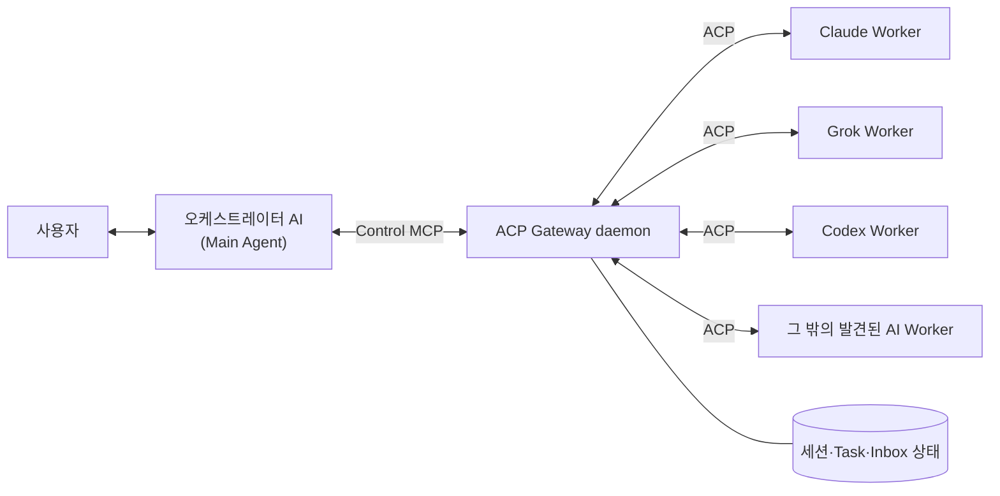

# ACP Gateway v1.3.2

혹시 여러 AI 에이전트를 쓰고 계신가요?

Claude에게 물어봤다가, Codex로 코드를 고치고, Grok에게 다시 리뷰를 맡기느라 터미널과 대화를 계속 돌려막고 계신가요?

“내가 이 에이전트들을 일일이 지휘하지 말고, 한 에이전트가 다른 에이전트를 알아서 활용하면 좋을 텐데…”라고 생각해 본 적이 있으신가요?

그런 당신을 위해 준비했습니다.

**한 에이전트 창에서 여러 AI 전문가에게 일을 나눠 맡기는 로컬 관제실 — ACP Gateway입니다.**

## 개요

ACP Gateway는 사용자가 직접 대화하는 AI, 즉 **오케스트레이터**가 로컬에 설치된 여러 AI Worker를 발견하고 ACP로 실행하며, 장기 작업과 권한 요청부터 최종 결과 회수까지 관리할 수 있게 해주는 미들웨어입니다. 코드와 도구 설명에서 사용하는 `Main`은 이 오케스트레이터 역할을 뜻합니다.

- ACP 세션과 provider 프로세스를 daemon이 계속 유지합니다.
- MCP가 재시작되어도 Worker 세션을 복구할 수 있습니다.
- 모델, 권한, 질문, 취소, 결과 수집을 오케스트레이터가 통제합니다.
- Worker에는 Gateway 제어 권한을 전달하지 않습니다.
- 로컬 단일 사용자·단일 머신 사용을 기준으로 합니다.

Node.js 22 이상과 macOS 또는 Linux가 필요합니다.

## 설치 방법

```bash
git clone https://github.com/creverse-ai-lab/agent_gateway.git
cd agent_gateway
npm ci
npm link
acp-gateway-bootstrap --install-all --refresh-registry --dry-run
acp-gateway-bootstrap --install-all --refresh-registry
```

마지막 두 명령 중 첫 번째는 설치 계획만 확인하는 dry-run이고, 두 번째가 실제 설치입니다. `--install-all`은 ACP 공식 registry가 지정한 `npx`·`uvx` 패키지를 전역으로 설치하거나 갱신할 수 있으므로 dry-run 결과에서 대상과 버전을 먼저 확인하세요. Registry manifest는 ACP가 관리하지만 실제 package와 binary는 각 공급자의 배포처에서 내려받습니다.

`--install-all`은 다음 작업을 수행합니다.

- PATH, 일반 CLI 경로, 전역 npm 패키지에서 설치된 AI 자동 탐지
- ACP 공식 registry와 대조해 현재 버전의 ACP agent/adapter 설치
- 오케스트레이터(Main) 전용 `agent-acp` Control MCP 등록
- 읽기 전용 `agent-acp-guide` 등록
- 발견된 AI 각각의 사용자 skill 경로에 `agent-delegator` 설치
- daemon 실행과 인증 상태 확인

이전 버전의 daemon이 남아 있으면 installer가 health 응답의 버전을 비교해 자동으로 교체한 뒤 다시 검사합니다. 따라서 `git pull`, `npm ci` 후 `--install-all --refresh-registry`를 실행하는 수동 업그레이드도 지원합니다.

기본 `--install-all`은 Codex, Claude, Grok 중 어느 agent를 사용자 대화용 **프론트 도어**로 사용할지 질문합니다. 선택한 하나에만 오케스트레이터용 Control MCP를 등록하고, 발견된 agent 전체에는 읽기 전용 Guide MCP와 skill을 설치합니다. 비대화형 설치에서는 Codex가 기본값이며 다음처럼 명시할 수 있습니다.

```bash
acp-gateway-bootstrap --install-all --front-door codex
acp-gateway-bootstrap --install-all --front-door claude
acp-gateway-bootstrap --install-all --front-door grok
```

여러 agent를 모두 오케스트레이터 후보로 등록하려면 `--target all`을 사용할 수 있습니다. 이 옵션은 각 agent 설정에 오케스트레이터 권한이 있는 Control MCP를 넣으므로, 신뢰하는 로컬 agent에만 사용하세요.

나중에 설치 계획만 다시 확인하려면:

```bash
acp-gateway-bootstrap --install-all --dry-run
```

새 버전으로 갱신할 때는 다음 명령 하나만 실행합니다.

```bash
acp-gateway-bootstrap --update
```

`--update`는 `git pull --ff-only`와 `npm ci`를 실행하고, ACP protocol·공식 registry의 상류 변경을 확인한 다음 `npm run ci`로 snapshot 검증과 전체 자동 테스트를 통과해야 다음 단계로 진행합니다. 이후 내부 dry-run 계획을 출력하고 ACP registry와 adapter, MCP 등록을 갱신합니다. 마지막으로 실행 중인 Gateway daemon을 새 버전으로 다시 시작하고 실제 버전까지 확인합니다. 설치 상태, Control identity와 최초 설치에서 선택한 프론트 도어는 그대로 유지됩니다. 상류 확인이 일시적으로 실패하면 경고를 남기되 이미 받은 소스의 로컬 검증은 계속하며, 테스트 실패는 daemon을 교체하기 전에 update 전체를 중단합니다.

사용자가 수정한 `agent-delegator`를 보호하기 위해 skill은 최초 `--install-all`에서만 설치하며 `--update`에서는 건드리지 않습니다. `--install-skill`도 최초 설치용이므로 이미 installer가 관리하는 복사본을 자동으로 덮어쓰지 않습니다. 로컬 소스 변경을 보호하기 위해 Git 작업 트리가 깨끗하지 않으면 update를 중단하므로 먼저 변경 사항을 commit하거나 stash해야 합니다. 소스와 직접 연결되는 `npm link`는 최초 설치 후 다시 할 필요가 없습니다.

현재 checkout에 포함된 최신 기본 skill만 별도로 반영하려면 먼저 계획을 확인한 뒤 업데이트합니다.

```bash
acp-gateway-bootstrap --update-skill --dry-run
acp-gateway-bootstrap --update-skill
```

`--update-skill`은 installer 상태에 기록된 모든 `agent-delegator` 복사본을 대상으로 하며, Gateway 소스 pull, adapter·MCP 변경, daemon 재시작은 수행하지 않습니다. 설치 시 기록한 SHA-256 tree digest와 현재 설치본이 일치할 때만 교체하므로 사용자가 수정한 skill은 `customized` 경고와 함께 보존됩니다. v1.3.0 이하에서 설치해 digest가 없는 복사본도 내용이 현재 기본본과 같더라도 `legacy-unverified`로 보존합니다. 내용을 검토한 뒤 기본본으로 덮어쓰려는 경우에만 `--update-skill --force`를 사용하세요. 최신 Gateway 소스를 먼저 받을 때는 `acp-gateway-bootstrap --update`가 성공한 다음 별도 명령으로 실행합니다.

주요 installer 옵션:

| 옵션 | 설명 |
|---|---|
| `--version`, `-V` | 현재 설치된 ACP Gateway 버전 확인 |
| `--update` | 소스 pull·상류 확인·전체 테스트·dry-run 후 Adapter, MCP, daemon 갱신—사용자 skill 유지 |
| `--install-all` | Adapter, Guide, skill 전체 설치 후 프론트 도어 하나에 Control 등록 |
| `--front-door codex\|claude\|grok` | `--install-all`의 Control MCP 대상 명시 |
| `--install-control` | 오케스트레이터용 Control MCP만 설치 |
| `--install-guide` | 읽기 전용 Guide MCP만 설치 |
| `--install-skill` | 발견된 AI에 `agent-delegator` skill 최초 설치—기존 관리본은 보존 |
| `--update-skill` | 현재 checkout의 기본본으로 변경되지 않은 installer 관리 skill만 별도 갱신 |
| `--discover-agents` | 설치된 AI를 ACP 공식 registry와 대조 |
| `--registry-agent ID` | 발견 여부와 무관하게 registry agent 하나를 선택 설치 |
| `--refresh-registry` | 24시간 cache를 무시하고 공식 registry 갱신 |
| `--offline` | 저장된 registry cache만 사용 |
| `--target codex\|claude\|grok\|auggie\|all` | 오케스트레이터용 Control MCP 설치 대상 선택 |
| `--dry-run` | 실제 변경 없이 계획만 출력 |
| `--rotate-token` | Control token과 오케스트레이터 식별자(Main ID) 교체 |
| `--force` | 관리하지 않던 항목 또는 사용자가 수정한 관리 skill을 명시적으로 교체 |
| `--agent-auto-update on\|off` | ACP agent/adapter 자동 업데이트 설정 후 daemon 재시작 |
| `--agent-update-notifications on\|off` | health check 업데이트 알림 설정 후 daemon 재시작 |

Control token과 오케스트레이터 식별자(Main ID)는 `~/.acp-gateway/install.json`에 권한 `0600`으로 저장되며 반복 설치에서도 재사용됩니다.

Skill은 Codex `~/.codex/skills`, Claude `~/.claude/skills`, Grok `~/.grok/skills`, Auggie `~/.augment/skills`에 설치합니다. 별도 경로가 알려지지 않은 registry provider는 공용 `~/.agents/skills`를 사용합니다. 같은 공용 경로를 사용하는 provider가 여러 개면 skill 파일은 한 번만 복사하고 installer 상태에는 각 provider를 모두 기록합니다.

Control·Guide MCP 등록은 Codex, Claude, Grok, Auggie를 지원합니다. 기본 `--install-all`에서 Control은 사용자가 프론트 도어로 선택한 Codex·Claude·Grok 중 하나에만 등록되고, Guide와 skill은 발견된 지원 agent 전체에 설치됩니다. `--target`은 고급 수동 대상 지정 용도로 유지됩니다. Control MCP는 Gateway 전체 제어 권한이 있으므로 신뢰하는 로컬 agent에만 설치하세요.

공식 registry 원본은 `https://cdn.agentclientprotocol.com/registry/v1/latest/registry.json`이며 `~/.acp-gateway/registry.json`에 24시간 캐시합니다. 발견된 provider 실행 정의는 `~/.acp-gateway/providers.json`에 저장됩니다. `npx`·`uvx` 배포는 registry에 고정된 버전을 설치하고, binary 배포는 이미 설치된 실행 파일을 사용합니다. registry에 등록되지 않은 임의의 AI는 ACP 실행 계약을 안전하게 추론할 수 없으므로 자동 등록하지 않습니다.

### ACP 상류 버전 모니터링

저장소는 ACP 공식 protocol 저장소와 registry 전체를 매일 확인합니다. Protocol release·공개 wire version, registry agent의 추가·삭제·버전·배포 정보가 바뀌면 `automation/acp-upstream-monitor` 브랜치에서 `dev` 대상 검토 PR을 생성하거나 기존 PR을 갱신합니다. npm과 GitHub Actions의 일반 버전 업데이트는 Dependabot이 별도의 `dev` 대상 PR로 관리합니다. 보안 업데이트는 GitHub 정책에 따라 기본 브랜치인 `main`을 대상으로 합니다.

```bash
npm run monitor:check   # 변경이 있으면 보고서를 출력하고 종료 코드 2 반환
npm run monitor:update  # 검토용 snapshot을 현재 상류 상태로 갱신
npm run monitor:sync-dependencies  # 저장소가 직접 포함한 ACP adapter 버전 동기화
npm run update:upstream  # 위 갱신과 전체 CI를 한 번에 실행하는 수동 유지보수 경로
```

GitHub Actions의 write/PR 권한을 사용할 수 없는 저장소에서는 maintainer가 `npm run update:upstream`을 실행하면 예약 workflow가 하던 snapshot 갱신, 관리 대상 ACP adapter pin·lockfile 동기화와 전체 CI를 로컬에서 한 번에 수행할 수 있습니다. 이 명령은 커밋이나 push를 자동으로 하지 않습니다. `git diff`로 protocol·registry 변경과 테스트 결과를 검토한 뒤 `dev`에 커밋하면 됩니다. 일반 사용자의 `acp-gateway-bootstrap --update`는 저장소 파일을 임의로 수정하지 않고 상류 변경을 보고한 뒤 runtime adapter만 안전하게 갱신합니다.

두 업데이트 경로는 역할이 다릅니다.

- **ACP agent/adapter 버전:** daemon이 공식 registry의 고정 버전을 주기적으로 확인해 자동 갱신합니다. `acp-gateway-bootstrap --update`를 실행할 때도 즉시 registry를 새로 읽고 같은 갱신을 수행합니다.
- **ACP protocol wire version:** 새 major를 감지해 PR에 경고하지만 자동 적용하지 않습니다. 호환성 테스트 후 `src/acp-version.js`와 monitor 설정을 함께 바꿔야 합니다.
- **Gateway npm 의존성:** Dependabot PR에서 lockfile과 CI 결과를 확인한 뒤 병합합니다.

현재 runtime은 ACP wire version 1을 사용합니다. 공식 저장소의 `schema/v2`도 감지되지만, v2 지원으로 표시하거나 자동 전환하지 않습니다. Snapshot PR은 알림과 검토 시작점이며 자동 병합 또는 Gateway release를 수행하지 않습니다.

v1.1.0부터 daemon은 시작 시점과 이후 24시간마다 ACP 공식 registry를 확인합니다. 발견된 `npx`·`uvx` adapter가 새 버전이면 자동으로 설치하고 provider 정의를 갱신합니다. 이미 실행 중인 Worker process는 중단하지 않으며, 새 process나 session부터 갱신된 adapter가 적용됩니다. 직접 설치해야 하는 binary 배포는 자동 교체하지 않고 health 경고로 남깁니다.

`agent_acp_setup` health 응답의 `agentUpdates`에는 확인 시각, 적용된 버전, 남은 수동 업데이트와 오류가 포함됩니다. 알림이 켜져 있으면 같은 응답의 `alerts`에 사용자에게 보여줄 메시지가 들어갑니다. 즉 Gateway가 임의로 화면에 push하는 방식은 아니며, 오케스트레이터가 health check 결과를 받을 때 알림을 사용자에게 전달합니다. 즉시 다시 확인하려면 `refreshAgentUpdates: true`로 setup을 호출합니다.

Gateway 자체 소스는 자동으로 pull하거나 설치하지 않습니다. 같은 주기에서 현재 Git 저장소의 원격 `main`에 게시된 `package.json` 버전만 확인하며, 더 높은 버전이 있으면 health의 `gatewayUpdate`와 `gateway_source_update_available` 알림으로 `acp-gateway-bootstrap --update` 실행을 안내합니다. 따라서 로컬 source, 설치 상태와 사용자 정의 skill은 사용자가 명시적으로 업데이트하기 전까지 변경되지 않습니다.

자동 업데이트와 알림은 기본으로 켜집니다. 설치 후 다음처럼 각각 끄거나 다시 켤 수 있으며, 사용자 정의 skill은 변경하지 않습니다.

```bash
acp-gateway-bootstrap --agent-auto-update off
acp-gateway-bootstrap --agent-update-notifications off

acp-gateway-bootstrap --agent-auto-update on
acp-gateway-bootstrap --agent-update-notifications on
```

예약 실행과 Dependabot 설정은 GitHub의 기본 브랜치에 존재해야 활성화됩니다. 따라서 `dev` 검증이 끝나면 monitoring workflow 자체는 `main`에 병합하고 원격 `dev` 브랜치를 유지해야 합니다. 또한 저장소의 **Settings → Actions → General → Workflow permissions**에서 GitHub Actions의 PR 생성을 허용해야 자동 PR이 생성됩니다.

## 사용 방법

Installer는 발견된 AI에 `agent-delegator` skill을 함께 설치합니다. 이 skill은 사용자의 요청에서 Worker, 모델과 권한 범위를 파악하고, Gateway 세션 생성부터 작업 전달, 진행 확인, 질문·권한 처리와 결과 회수까지 안내합니다. 설치 후에는 MCP 도구 이름을 외울 필요 없이 오케스트레이터에게 자연어로 작업을 요청하면 됩니다.

기본 제공되는 `agent-delegator`는 범용 사용을 위한 시작점입니다. 자주 사용하는 Worker, 기본 모델, 권한 정책, 리뷰 순서나 결과 형식이 있다면 설치된 skill을 사용자 작업 방식에 맞게 수정해 사용할 수 있습니다. `acp-gateway-bootstrap --update`와 일반 `--update-skill`은 사용자 수정본을 덮어쓰지 않습니다. 저장소의 최신 기본본으로 되돌리고 싶을 때만 `--update-skill --force`를 명시적으로 실행하세요.

예를 들어 사용자가 대화 중인 오케스트레이터 AI에 다음처럼 요청할 수 있습니다.

```text
Claude Sonnet에게 이 저장소의 인증 코드를 읽기 전용으로 검토시키고 결과를 정리해줘.

Grok 4.5에게 현재 설계의 보안 취약점을 red-team 검토시키고, permission 요청은 나에게 확인해줘.
```

내부적으로는 다음 순서로 동작합니다.

1. `agent_acp_setup`으로 provider 확인
2. `agent_acp_session_open`으로 Worker 세션 생성
3. 필요한 경우 `agent_acp_config`로 Worker가 지원하는 모델·모드·추론 수준 등의 파라미터 조회·설정
4. `agent_acp_prompt`로 작업 전달
5. `agent_acp_poll`로 이벤트와 상태 확인
6. 필요한 경우 `agent_acp_permission` 또는 `agent_acp_answer`로 응답
7. 완료 후 세션을 재사용하거나 `agent_acp_session`으로 종료

### Worker 파라미터 제어

`agent_acp_config`는 Worker가 ACP `configOptions`로 직접 공개한 세션 파라미터를 조회하고 변경합니다. `action: list`로 가능한 값과 현재값을 확인한 뒤, 세션이 작업 중이 아닐 때 `action: set`, `configId`, `value`를 전달합니다. ACP wire v1 기준으로 선택형 문자열과 boolean 설정을 지원하며, `model`, `mode`, `model_config`, `thought_level` 같은 category를 그대로 보존합니다.

Gateway는 Worker가 공개하지 않은 `temperature`, `max_tokens` 같은 값을 임의로 만들어 전달하지 않습니다. 따라서 지원 범위는 Claude, Codex, Grok 등 각 ACP adapter가 실제로 광고하는 옵션에 따라 달라집니다. 설정 변경은 `config_changed` 세션 이벤트로 남으므로, 추후 DAG 오케스트레이터가 노드의 작업 유형·비용·품질 정책에 따라 파라미터를 선택하고 결과와 함께 추적할 수 있습니다. process 단위로 모델을 고정하는 Worker는 기존 세션에서 모델을 바꾸지 않고 새 세션을 열어야 합니다.

v1.3.0부터 poll 기본값이 절약형입니다. 턴이 진행 중일 때 `result`는 자동으로 생략되고(`includeResult: true`로 명시할 때만 포함), 종료 후 poll의 `result.text`에는 누적 transcript가 아니라 **최종 답변 세그먼트**(마지막 작업 경계 이후의 메시지 텍스트)만 담깁니다. 진행 narration은 `includeInspection: true`로 조회합니다. `agent_acp_session` `get`의 `includeTranscript: true`는 메모리에 남은 bounded transcript를 반환하며, overflow된 전체 transcript는 `resultArtifact`를 따라 회수합니다. `cursor`/`toCursor`/`eventTypes`로 보존된 이벤트 이력도 범위 조회할 수 있습니다. 자세한 회수 경로는 `agent-delegator` skill의 "Retrieve the correct result" 표를 따르세요.

인라인 상한을 넘는 데이터는 전부 `~/.acp-gateway/artifacts`의 파일로 스필되고 응답에는 잘린 미리보기와 포인터(경로·바이트 수·완료 여부)가 실립니다 — 4KB(UTF-8)를 넘는 tool 이벤트 payload는 `dataArtifact`, 64KB를 넘는 최종 답변은 `textArtifact`, 메모리 상한(1MB)을 넘는 transcript는 `resultArtifact`. 인라인에는 상한 내 내용만 유지하므로 RAM과 오케스트레이터 컨텍스트가 결과 크기에 따라 늘어나지 않습니다. Artifact는 파일당 100MB·전체 512MB이고, 라이브 세션이 참조하는 파일은 24시간 정리에서 보존됩니다. 동시 미응답 권한·질문 요청은 세션당 64개의 안전 상한을 따르며, 큰 설명 chunk는 32MB protocol frame 상한 안에서 그대로 처리합니다.

### 권한 정책

세션을 열 때 다음 정책 중 하나를 선택합니다.

| 정책 | 용도 |
|---|---|
| `read_only` | 분석, 검토, 읽기 전용 작업 |
| `ask` | 파일 변경이나 명령 실행 전에 오케스트레이터 승인 필요 |
| `auto_approve` | 사용자가 허용한 세션 경계 안에서 자동 승인 |

Control token, 오케스트레이터 식별자(Main ID)와 Gateway socket 경로는 ACP Worker 환경에서 제거됩니다. Worker 세션에 Control MCP를 다시 주입하는 것도 차단합니다.

### 세션과 데이터

- 기본 상태 파일: `~/.acp-gateway/state.json`
- idle resumable 세션은 기본 30분 후 unload
- 결과와 이벤트는 기본 24시간 보존
- session resume checkpoint는 기본 7일 보존
- 장시간 유지가 필요한 세션은 `pin` 사용
- 응답 본문, thought, 전체 이벤트 이력은 상태 파일에 영구 저장하지 않음
- 인라인 상한을 넘은 결과와 terminal 출력은 `~/.acp-gateway/artifacts`에 임시 저장 후 결과 보존 기간에 맞춰 정리

## ACP와 MCP란?

[ACP(Agent Client Protocol)](https://agentclientprotocol.com/)는 코드 에디터·IDE와 AI 코딩 에이전트 사이의 통신을 표준화하는 프로토콜입니다. 에디터마다 Claude, Codex, Grok 같은 에이전트를 별도로 통합하는 대신, ACP라는 공통 규격으로 세션 생성, prompt 전달, tool 호출, 권한 요청, 진행 이벤트와 결과를 주고받습니다. 언어 도구 연결을 LSP가 표준화했다면, ACP는 코딩 에이전트 연결을 표준화하는 역할에 가깝습니다.

ACP 규격에서 로컬 agent는 일반적으로 JSON-RPC over stdio로 실행되며, 원격 agent는 HTTP 또는 WebSocket 연결을 사용할 수 있습니다. **현재 ACP Gateway 구현 범위는 로컬 단일 머신의 ACP agent와 Unix socket 통신입니다.** 원격 agent 연결은 아직 지원하지 않습니다.

- **ACP**는 에이전트 자체를 실행하고 대화하며 작업 상태를 관리하는 규격입니다.
- **MCP(Model Context Protocol)**는 AI가 외부 도구, 데이터, 애플리케이션과 연결되는 공통 인터페이스입니다.
- **ACP Gateway**는 내부에서 ACP로 Worker를 관리하고, 오케스트레이터에는 MCP 도구로 그 제어 기능을 제공합니다.

즉, MCP와 ACP 중 하나를 고르는 구조가 아닙니다. MCP는 오케스트레이터가 Gateway를 조작하는 입구이고, ACP는 Gateway가 다른 AI 에이전트와 실제로 작업하는 통신로입니다.

현재 최신 명세는 [MCP 2026-07-28](https://modelcontextprotocol.io/specification/2026-07-28)입니다. ACP Gateway는 이 명세 전체를 구현한다고 주장하지 않으며, 그중 장시간 작업을 task handle로 시작하고 상태·결과를 다시 조회하는 **MCP Tasks extension 흐름**을 지원합니다. 현재 로컬 stdio MCP 서버에는 stateless HTTP core나 OAuth/OIDC 인증이 적용되지 않습니다. MCP 2026-07-28의 전체 변경 사항은 [MCP 공식 명세](https://modelcontextprotocol.io/specification/2026-07-28)와 [Anthropic의 소개](https://claude.com/blog/bringing-mcp-2026-07-28-to-claude)를 참고하세요.

## Agent CLI 직접 활용·단순 MCP 호출과 무엇이 다른가요?

여기서 **Agent CLI 직접 활용**은 사람이 터미널을 번갈아 조작하는 경우가 아니라, 사용자가 대화 중인 오케스트레이터가 shell tool로 `claude`, `grok` 같은 다른 AI CLI 프로세스를 실행하고 stdout 결과를 받는 방식을 뜻합니다. **단순 MCP 호출**은 그 CLI 실행을 MCP tool 하나로 감싼 일반적인 wrapper 방식입니다.

`O`는 일반적인 기본 사용 흐름에서 지원한다는 뜻이고, `X`는 별도의 daemon, session 저장소 또는 양방향 protocol을 직접 구현해야 한다는 뜻입니다. CLI나 MCP protocol 자체의 이론적 한계를 의미하지는 않습니다.

| 기능 | Agent CLI 직접 활용 | 단순 MCP wrapper | ACP Gateway | 실제 차이 |
|---|:---:|:---:|:---:|---|
| 다른 AI 실행 | O | O | O | 세 방식 모두 Worker를 호출할 수 있음 |
| provider·model 선택 | O | O | O | CLI는 agent별 flag, Gateway는 공통 입력 사용 |
| 같은 session에 후속 피드백 | O | X | O | CLI는 resume ID를 오케스트레이터가 직접 관리, Gateway는 session ID로 관리 |
| Worker의 built-in 서브에이전트 사용 | O | O | O | prompt로 요청 가능하지만 Gateway는 child event까지 회수 |
| 여러 Worker 동시 실행 | O | O | O | CLI·wrapper는 호출 관계를 오케스트레이터가 직접 관리 |
| 연결과 분리된 장시간 작업 | X | X | O | Gateway는 MCP Task handle로 나중에 다시 조회 가능 |
| 진행 event 조회·재생 | X | X | O | Gateway는 cursor 이후의 새 event만 다시 조회 가능 |
| Worker permission 요청에 응답 | X | X | O | Gateway가 요청을 Inbox에 보존하고 오케스트레이터의 승인·거부를 전달 |
| Worker의 중간 질문에 응답 | X | X | O | 단발 호출은 같은 실행 흐름으로 답하기 어렵고 Gateway는 elicitation으로 왕복 |
| Worker process까지 상태를 확정하며 취소 | X | X | O | Gateway가 ACP cancel과 하위 process 종료를 함께 관리 |
| 오케스트레이터·MCP 재시작 후 작업 재연결 | X | X | O | 별도 daemon이 Worker와 session을 유지 |
| 중복 없는 증분 결과 회수 | X | X | O | cursor와 `includeResult`로 필요한 데이터만 회수 |
| 방치 session 자동 정리 | X | X | O | idle unload와 retention GC 적용 |
| 구조화된 실패 진단·복구 상태 | X | X | O | event, task 상태와 checkpoint를 분리해 확인 |

## 동작 개념도



오케스트레이터는 MCP를 통해 작업을 지시하고, Gateway는 각 Worker와 ACP로 통신합니다. Gateway daemon은 Unix socket, ACP 연결, 세션, 이벤트, permission 요청과 최소 복구 상태를 관리하므로 오케스트레이터나 MCP 연결이 다시 시작되어도 진행 중인 Worker를 이어서 제어할 수 있습니다.

## 작업 파이프라인

1. **발견·설치** — installer가 로컬 AI를 찾고 ACP 공식 registry에서 대응 agent와 adapter를 준비합니다.
2. **작업 생성** — 오케스트레이터가 Control MCP로 provider, 모델, 작업 경로와 권한 정책을 지정해 세션을 엽니다.
3. **Worker 실행** — Gateway가 해당 provider 프로세스를 시작하거나 기존 프로세스·세션을 재사용합니다.
4. **ACP 작업 전달** — prompt, 파일 작업, tool event와 중간 결과가 ACP를 통해 오갑니다.
5. **권한·질문 처리** — Worker의 permission 요청이나 질문은 Gateway Inbox를 거쳐 오케스트레이터에게 전달되고, 그 응답이 다시 Worker로 돌아갑니다.
6. **결과 회수·재사용** — 오케스트레이터는 MCP Task 또는 poll로 상태와 결과를 받고, 필요하면 같은 세션을 다시 호출하거나 복구합니다.

## v1.3.2 변경 사항

- **최종 결과 중심 poll** — 기본 poll은 진행 메시지·thought·tool 이벤트를 전달하지 않고, 종료 시 최종 `result`와 Main이 처리해야 하는 permission·질문만 보냅니다. 중간 증거는 `eventTypes`, `includeThoughts`, `includeToolEvents`, `includeInspection`으로 명시 요청해야 합니다.
- **usage 이벤트 차단** — 반복되는 ACP `usage_update`는 Gateway에 저장하거나 poll을 깨우지 않습니다. provider 계측 신호가 frontdoor tool call과 컨텍스트 소비로 증폭되는 경로를 제거했습니다.
- **간결한 Worker 반환 기본** — `agent-delegator`가 상세 보고서가 필요하지 않은 요청에 결론·필수 근거·변경 경로·테스트 상태만 간결히 반환하도록 지시합니다.

## v1.3.1 변경 사항

- **ACP/MCP 실행 가이드 완성** — `agent-delegator`가 routing 결과를 실제 Control MCP 호출로 옮기는 전 과정을 설명합니다. provider·정확한 모델 검증, session 경계와 `mcpServers`, 직접 prompt와 MCP Task, cursor polling, permission·structured input, 복구·정리, bounded result·artifact 회수 계약을 포함합니다.
- **Skill 전용 안전 업데이트** — `--update-skill`이 Gateway runtime을 건드리지 않고 installer 관리본만 갱신합니다. 설치 시 기록한 SHA-256 tree digest로 사용자 수정 여부를 확인하며 customized·legacy install은 기본적으로 보존하고 `--force`에서만 덮어씁니다.
- **초기 설치와 갱신 분리** — `--install-skill`은 최초 설치 경로로 고정하여 기존 관리본을 암묵적으로 교체하지 않습니다. `--dry-run`, 대상 검증, 공용 skill root 중복 제거와 상태 기록도 두 경로에서 유지합니다.

## v1.3.0 변경 사항

v1.2.x 대비 Worker 위임 턴 1회당 오케스트레이터로 유입되는 토큰 사용량이 실측 기준 **최대 87% 감소**합니다(동일 시나리오 재생 벤치마크, 전체 턴 기준 약 84~87%). 누적 결과 재전송과 tool 페이로드 이중 전달을 기본 경로에서 제거한 결과이며, 절감치는 `agent_acp_setup`의 `metrics`로 직접 확인할 수 있습니다.

- **Poll 기본값 절약형 전환** — 턴이 진행 중일 때 누적 `result`를 반복 전송하지 않고 종료 후에만 포함하며, `tool_call*` 이벤트는 poll과 subscribe 모두 `includeToolEvents: true`로 요청할 때만 전달합니다.
- **결과 모델 분리** — Worker 턴의 누적 transcript에서 최종 답변을 분리합니다. `result.text`는 마지막 작업 경계(`tool_call` 시작, permission, elicitation) 이후의 메시지 텍스트만 담고, 진행 narration은 `includeInspection: true`(세그먼트별 4KB 미리보기 + artifact 포인터, `inspectionDropped` 카운트)로 조회합니다. `includeTranscript: true`는 bounded inline transcript를 반환하고 overflow 전체본은 `resultArtifact`로 회수합니다. 진행 업데이트(`tool_call_update`)·thought·usage 등은 경계를 만들지 않아 답변을 자르거나 지울 수 없으며, 최종 세그먼트가 비면 retained transcript로 안전하게 폴백합니다.
- **Cap-and-point 전달** — 상한에 걸리는 모든 페이로드가 정보 손실 없이 디스크 포인터를 갖습니다. 4KB(UTF-8 byte 기준)를 넘는 tool 이벤트 `data`·permission `toolCall`·elicitation schema·메시지 청크 사본은 잘린 미리보기와 함께 `dataArtifact`로, 64KB(`maxInlineResultBytes`)를 넘는 최종 답변은 `textArtifact`로 스필됩니다. 응답용 Inbox 레코드는 전문을 유지합니다.
- **Poll 조회 표면 확장** — `toCursor`와 `eventTypes`(정확 일치, 후행 `*`만 접두어)로 보존된 이벤트 이력을 대기 없이 범위 조회할 수 있고, `filteredCount`로 커서가 건너뛴 이벤트 수를 확인합니다. 대기는 호출자가 실제로 받을 이벤트나 상태 변화가 있을 때만 깨어나며, 숫자 인자는 음수·NaN·소수를 명시적으로 거부합니다.
- **생명주기 안정화** — 새 턴 시작 시 retention 타이머를 리셋하고 진행 중인 턴은 transient 정리에서 제외합니다. orphan 취소도 결과 모델을 거쳐 발행하며, 라이브 세션이 참조하는 artifact는 24시간 prune에서 보존됩니다.
- **전송량 계측** — Gateway가 poll 응답 수, byte, event type별 전달량을 누적해 `agent_acp_setup`의 `metrics`로 노출합니다. 토큰 절감을 추정이 아닌 운영 지표로 확인할 수 있습니다.
- **Skill 가이드 갱신** — `agent-delegator`에 결과 회수 경로 표(final/narration/transcript/tool evidence/oversized payload)와 포인터 기반 Worker 핸드오프(경로만 전달, 하류 Worker가 직접 읽는 콜드 스타트) 지침을 추가했습니다.

## v1.2.1 변경 사항

- **Claude 프론트 도어 설치 수정** — Claude Code 2.1.220의 variadic `-e` 파싱 규칙에 맞춰 MCP 이름을 환경변수보다 먼저 전달합니다. `--install-all --front-door claude`가 `Invalid environment variable format: agent-acp`로 중단되던 문제를 해결했습니다.
- **Claude MCP 회귀 테스트** — Control MCP 등록 명령에서 `agent-acp` 이름이 환경변수 앞에 위치하는지 검증합니다.

## v1.2.0 변경 사항

- **Worker 파라미터 제어** — `agent_acp_config`로 ACP Worker가 공개한 설정 목록과 현재값을 조회하고, 지원되는 select·boolean 값을 세션 단위로 변경할 수 있습니다.
- **자율 오케스트레이션 기반** — 모델, 모드, 추론 수준과 모델 설정 category를 공통 형식으로 노출하고 변경 이력을 `config_changed` 이벤트로 남겨 향후 DAG 노드별 파라미터 정책에 사용할 수 있게 했습니다.
- **안전한 동적 검증** — Worker가 광고하지 않은 옵션, 허용 목록 밖의 select 값, 잘못된 boolean 타입, 실행 중 세션의 변경을 차단합니다. process 단위 모델 변경은 새 세션을 요구합니다.
- **완전한 수동 업데이트** — `--update`가 상류 확인과 전체 테스트를 daemon 교체 전에 수행하며, GitHub Actions 없이 snapshot·adapter pin을 갱신하는 `npm run update:upstream`을 추가했습니다.

## v1.1.0 변경 사항

- **프론트 도어 선택 설치** — `--install-all` 실행 시 Codex, Claude, Grok 중 사용자가 대화할 오케스트레이터 하나를 선택합니다. 선택한 AI에는 Control MCP를, 발견된 AI 전체에는 Guide MCP와 `agent-delegator` 스킬을 설치합니다. 자동화 환경에서는 `--front-door codex|claude|grok`으로 명시할 수 있습니다.
- **ACP adapter 자동 업데이트** — Gateway daemon이 시작될 때와 이후 24시간마다 ACP agent registry를 확인합니다. 더 최신인 `npx`·`uvx` adapter는 자동으로 갱신하며, 이미 실행 중인 작업은 종료하지 않고 다음 Worker 실행부터 새 버전을 적용합니다.
- **업데이트 상태 알림** — health check에서 adapter 업데이트 적용·실패, 수동 업데이트 필요, 오래된 registry, downgrade 위험을 확인할 수 있습니다. `agent-delegator`는 이 알림을 사용자에게 전달합니다.
- **Gateway 새 버전 알림** — GitHub `main`에 로컬보다 높은 버전이 있으면 health check로 알려줍니다. Gateway 소스는 임의로 변경하지 않으며, 사용자가 `acp-gateway-bootstrap --update`를 실행할 때만 갱신합니다.
- **상류 변경 자동 모니터링** — GitHub Actions가 ACP protocol release와 공식 registry의 agent 버전을 매일 확인하고, 변경이 발견되면 `dev` 브랜치 대상 업데이트 PR을 생성하거나 갱신합니다.
- **설치·업데이트 안정화** — 이전 버전 daemon이 남아 health check가 실패하던 문제를 보완해 버전 불일치 시 daemon을 교체합니다. `--version`을 추가했고, `--update`는 사용자가 수정한 `agent-delegator` 스킬을 덮어쓰지 않습니다.
- **의존성 기준 갱신** — Claude ACP `0.64.1`, Codex ACP `1.1.9`, MCP SDK `1.30.0` 기준으로 registry snapshot과 런타임 의존성을 갱신했습니다.

---

Dev by 윤치영
