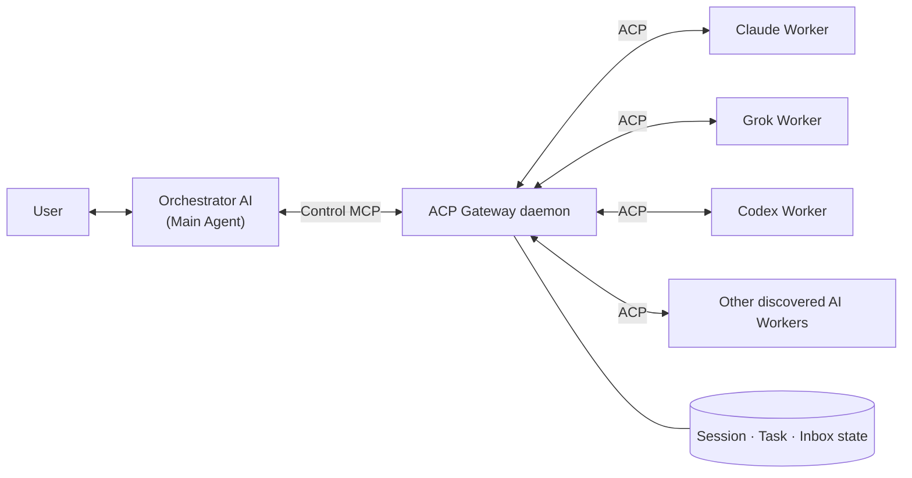

# ACP Gateway

**English** | [한국어](README.ko.md) | [日本語](README.ja.md) | [简体中文](README.zh-CN.md)

[](https://www.npmjs.com/package/acp-gateway-daemon) [](https://github.com/creverse-ai-lab/agent_gateway/actions/workflows/ci.yml?query=branch%3Amain) [](LICENSE)

**Let the coding agent you already use delegate work to Claude Code, Codex, and Grok on demand — over MCP + ACP, with persistent sessions, interactive approvals, and no predefined workflows.**

ACP Gateway is a local daemon and Model Context Protocol (MCP) server: whichever of Claude Code, Codex, or Grok you talk to uses it to delegate work to the others, and to any other installed agent listed in the official Agent Client Protocol (ACP) registry.

Do you use more than one AI agent?

Do you ask Claude a question, have Codex fix the code, then hand the review to Grok — juggling terminals and conversations the whole time?

Have you ever thought, “Instead of directing each of these agents myself, I wish one agent would just put the others to work for me…”?

That is what this is for.

## Overview

ACP Gateway is middleware that lets the AI you talk to directly — the **orchestrator** — discover the AI Workers installed on your machine, run them over ACP, and manage everything from long-running tasks and permission requests to retrieving the final result. `Main`, as used in the code and tool descriptions, means this orchestrator role.

- Claude Code, Codex, and Grok are supported as built-in Workers; other ACP-capable AIs installed locally are discovered by matching them against the official ACP registry.
- The daemon keeps ACP sessions and provider processes alive.
- Worker sessions can be recovered even when MCP restarts.
- The orchestrator controls models, permissions, questions, cancellation, and result collection.
- The Gateway strips its token, socket and Main identity from Worker environments, but a Worker that reads files without going through the Gateway can still find the token; see [Permission policies](#permission-policies).
- Designed for local, single-user, single-machine use.

## Use cases

- **One conversation, several agents** — From Claude Code, have Codex implement a change and Grok review it, without leaving the conversation or switching terminals.
- **Follow-ups in the same session** — Send feedback to the Worker that did the work instead of starting over. If its session was unloaded while idle, the next prompt reconnects it on providers that support resume or load.
- **Approvals from your main agent** — Under the `ask` policy, a Worker's permission requests and questions come to the agent you talk to, which approves, denies or answers them, or checks with you first.
- **Results after a reconnect** — After your host reconnects or the Gateway restarts, `agent_acp_inbox {action: "attention"}` lists what is still waiting on you and the finished results you have not collected.
- **Reviews that cannot touch your tree** — Open a reviewer with `workspace: "snapshot"` so it works in a private copy of the repository, then read its changes as a patch with `workspace_diff` and apply only what you want.
- **Why a session stopped** — Each session records the reason for its status, and `agent_acp_session {action: "check"}` tells you, without starting anything, whether it can come back.

## Quick start

### Requirements

Node.js 22 or later, and macOS or Linux.

### Install

Install the Gateway from npm, then let the bootstrap set it up for the agents on your machine:

```bash
npm install -g acp-gateway-daemon
acp-gateway-bootstrap --install-all --refresh-registry --dry-run
acp-gateway-bootstrap --install-all --refresh-registry
```

The Claude Worker runs the Claude CLI you have installed: the one `CLAUDE_CODE_EXECUTABLE` names if it is not blank, otherwise the first `claude` in an absolute directory on the daemon's PATH (skipping copies inside the Gateway's own dependencies and any binary bundled with the Claude Agent SDK), otherwise `~/.local/bin/claude`; if none is found, Claude is reported as not installed.

Of the last two commands, the first is a dry-run that only shows the installation plan, and the second performs the actual installation. `--install-all` can install or update, globally, the `npx` and `uvx` packages named by the official ACP registry, so check the targets and versions in the dry-run output first. The registry manifest is maintained by ACP, but the actual packages and binaries are downloaded from each vendor's distribution site. What the installation changes on your machine is listed in [What installation changes on your machine](#what-installation-changes-on-your-machine).

By default, `--install-all` asks which of Codex, Claude, or Grok you want to use as the **front door** — the agent you talk to. The Control MCP for the orchestrator is registered only with the one you choose, while the read-only Guide MCP and the skill are installed for every discovered agent. In non-interactive installs Codex is the default, and you can choose explicitly like this:

```bash
acp-gateway-bootstrap --install-all --front-door codex
acp-gateway-bootstrap --install-all --front-door claude
acp-gateway-bootstrap --install-all --front-door grok
```

#### From source

To run the Gateway from a Git checkout instead, for example to change the code, clone and link it:

```bash
git clone https://github.com/creverse-ai-lab/agent_gateway.git
cd agent_gateway
npm ci
npm link
acp-gateway-bootstrap --install-all --refresh-registry --dry-run
acp-gateway-bootstrap --install-all --refresh-registry
```

`npm link` puts the same commands on your PATH, running straight from the checkout. The last two commands and the front-door choice work exactly as above.

### First delegation

The installer also installs the `agent-delegator` skill for every discovered AI. From your request, the skill works out the Worker, model, and permission scope, and it guides everything from creating a Gateway session and handing over the task to checking progress, handling questions and permission requests, and retrieving the result. After installation you do not need to memorize MCP tool names — just ask the orchestrator in natural language.

For example, you can ask the orchestrator AI you are talking to:

```text
Have Claude Sonnet review the authentication code in this repository, read-only, and summarize the result.

Have Grok 4.5 red-team the security weaknesses of the current design, and check with me on any permission requests.
```

Internally it works in this order:

1. `agent_acp_setup` checks the providers
2. `agent_acp_session_open` creates a Worker session
3. If needed, `agent_acp_config` reads and sets parameters the Worker supports, such as model, mode, and reasoning level
4. `agent_acp_prompt` hands over the task
5. `agent_acp_poll` checks events and status
6. If needed, `agent_acp_permission` or `agent_acp_answer` responds
7. When done, reuse the session or close it with `agent_acp_session`

The bundled `agent-delegator` is a general-purpose starting point. If you have a Worker you use often, a default model, a permission policy, a review order, or a result format, you can edit the installed skill to fit the way you work. `acp-gateway-bootstrap --update` and a plain `--update-skill` do not overwrite your edited copy. Run `--update-skill --force` explicitly only when you want to reset it to the version bundled with the installed Gateway.

### Permission policies

Choose one of the following policies when you open a session.

| Policy | Use |
|---|---|
| `read_only` | Analysis, review, and other read-only work |
| `ask` | Orchestrator approval is required before changing files or running commands |
| `auto_approve` | Automatic approval within the session boundary the user has allowed |

The Control token, the orchestrator identifier (Main ID), and the Gateway socket path are removed from the ACP Worker's environment, and re-injecting the Control MCP into a Worker session is blocked. This does not keep the token from every Worker: a Worker whose own tools read files without going through the Gateway (measured with Codex, even under `read_only`) can read the Control token stored in the front door's MCP configuration and act as a Main. So do not give such a Worker untrusted content, such as repositories, documents or web pages that could carry a prompt injection; for that work, prefer a provider whose file reads the Gateway mediates or sandboxes. The `permission_policy_partial` alert lists what the Gateway cannot enforce for a session. Stronger isolation is planned for a later release.

### Updating

How you update depends on how the Gateway was installed.

**npm install** — install the new release, then refresh the registrations and restart the daemon:

```bash
npm install -g acp-gateway-daemon@latest
acp-gateway-bootstrap --update
```

For an npm install, `--update` runs neither Git nor npm itself: it refreshes the ACP registry, the adapters and the MCP registrations, and restarts the daemon on the version npm installed. When a newer release is on npm, the Gateway's health check alert says so.

**Source checkout** — run just this one command:

```bash
acp-gateway-bootstrap --update
```

**App-managed runtime** — when a desktop app installed the Gateway for you (under `~/.acp-gateway/runtime/versions/`), the app updates it. There, `acp-gateway-bootstrap --update` leaves the Gateway files alone and only refreshes the registrations.

After updating, reconnect your host (Claude/Codex/Grok/Auggie) session so that the new tools and arguments become visible. For details on how this works, updating the skill, and the reconnection procedure, see the [Operations guide](docs/operations.md).

## How it works


```mermaid
flowchart LR
    U["User"] <--> M["Orchestrator AI<br/>(Main Agent)"]
    M <-->|"Control MCP"| G["ACP Gateway daemon"]
    G <-->|"ACP"| C["Claude Worker"]
    G <-->|"ACP"| X["Grok Worker"]
    G <-->|"ACP"| O["Codex Worker"]
    G <-->|"ACP"| A["Other discovered AI Workers"]
    G --- S[("Session · Task · Inbox state")]
```

The orchestrator directs work through MCP, and the Gateway talks to each Worker over ACP. The Gateway daemon manages the Unix socket, ACP connections, sessions, events, permission requests, and the minimal recovery state, so it can keep controlling in-progress Workers even when the orchestrator or the MCP connection restarts.

### Work pipeline

1. **Discovery and installation** — The installer finds the local AIs and prepares the matching agents and adapters from the official ACP registry.
2. **Task creation** — The orchestrator opens a session through the Control MCP, specifying the provider, model, working path, and permission policy.
3. **Worker execution** — The Gateway starts that provider's process, or reuses an existing process and session.
4. **Task handover over ACP** — Prompts, file operations, tool events, and intermediate results flow through ACP.
5. **Permission and question handling** — A Worker's permission requests and questions travel through the Gateway Inbox to the orchestrator, and the orchestrator's response goes back to the Worker.
6. **Result retrieval and reuse** — The orchestrator receives status and results through an MCP Task or poll, and can call the same session again or recover it if needed.

### Reliability

The Gateway also tells the orchestrator where delegated work stands, so it does not have to guess after a restart or a long silence.

- **Why a session is in its status** — Each status change records a reason and a time. A running Worker that has sent nothing for a while (5 minutes by default) is flagged as a possible stall; this is only a hint, and nothing is cancelled.
- **What an interruption left unknown** — A task cut short by a restart or a lost Worker says whether the Worker may already have acted on the prompt, and what to do next. `agent_acp_session {action: "check"}` reports, read-only and without starting anything, whether a session can come back.
- **Attention inbox** — `agent_acp_inbox {action: "attention"}` lists the requests waiting on the orchestrator and the finished results it has not received yet; `ack` marks them as seen.
- **Declared task links** — A run can name the task it follows up (`parentTaskId`) and the tasks whose results it used (`inputTaskIds`). With `scope: "mine"`, session and task lists show only the calling orchestrator's own work.
- **Quarantine after repeated restore failures** — After 3 failed restores in a row (by default), the Gateway stops restoring the session on its own and returns `SESSION_QUARANTINED` with the remaining options; a successful explicit restore lifts it.

## What are ACP and MCP?

[ACP (Agent Client Protocol)](https://agentclientprotocol.com/) is a protocol that standardizes communication between code editors or IDEs and AI coding agents. Instead of each editor integrating agents such as Claude, Codex, and Grok separately, they exchange session creation, prompt delivery, tool calls, permission requests, progress events, and results through the common ACP specification.

Under the ACP specification, a local agent is normally run as JSON-RPC over stdio, and a remote agent can use an HTTP or WebSocket connection. **The current ACP Gateway implementation covers ACP agents on a single local machine, over a Unix socket.** Connecting to remote agents is not supported yet.

- **ACP** is the specification for running an agent itself, talking to it, and managing its work state.
- **MCP (Model Context Protocol)** is a common interface for AI to connect to external tools, data, and applications.
- **ACP Gateway** manages Workers over ACP internally and offers that control to the orchestrator as MCP tools.

In other words, it is not a choice between MCP and ACP. MCP is the entrance through which the orchestrator operates the Gateway, and ACP is the channel through which the Gateway actually works with the other AI agents.

The latest specification is currently [MCP 2026-07-28](https://modelcontextprotocol.io/specification/2026-07-28). ACP Gateway does not claim to implement this entire specification; it supports the **MCP Tasks extension flow**, in which a long-running job is started as a task handle and its status and result are queried again later. The current local stdio MCP server does not apply the stateless HTTP core or OAuth/OIDC authentication. For the full set of changes in MCP 2026-07-28, see the [official MCP specification](https://modelcontextprotocol.io/specification/2026-07-28) and [Anthropic's introduction](https://claude.com/blog/bringing-mcp-2026-07-28-to-claude).

## How is this different from using an agent CLI directly or a plain MCP call?

Here, **using an agent CLI directly** does not mean a person switching between terminals; it means the orchestrator you are talking to runs another AI CLI process, such as `claude` or `grok`, through a shell tool and receives the stdout result. A **plain MCP call** is the common wrapper approach that packages that CLI execution as a single MCP tool.

`O` means it is supported in the ordinary default usage flow, and `X` means you would have to build a separate daemon, session store, or bidirectional protocol yourself. It does not describe a theoretical limit of the CLI or of the MCP protocol itself.

| Capability | Direct agent CLI use | Plain MCP wrapper | ACP Gateway | Actual difference |
|---|:---:|:---:|:---:|---|
| Run another AI | O | O | O | All three approaches can call a Worker |
| Choose provider/model | O | O | O | A CLI uses per-agent flags; the Gateway uses a common input |
| Follow-up feedback in the same session | O | X | O | With a CLI the orchestrator manages the resume ID itself; the Gateway manages it by session ID |
| Use the Worker's built-in subagents | O | O | O | Can be requested through the prompt, but the Gateway also retrieves child events |
| Run multiple Workers concurrently | O | O | O | With a CLI or wrapper, the orchestrator manages the call relationships itself |
| Long-running work detached from the connection | X | X | O | The Gateway lets you query it again later through an MCP Task handle |
| Query and replay progress events | X | X | O | The Gateway can re-query only the new events after a cursor |
| Respond to Worker permission requests | X | X | O | The Gateway keeps the request in the Inbox and relays the orchestrator's approval or denial |
| Answer a Worker's mid-run questions | X | X | O | A one-shot call can hardly answer within the same run; the Gateway round-trips through elicitation |
| Cancel with a confirmed state down to the Worker process | X | X | O | The Gateway manages the ACP cancel and the termination of child processes together |
| Reconnect to work after an orchestrator or MCP restart | X | X | O | A separate daemon keeps the Worker and session alive |
| Incremental result retrieval without duplicates | X | X | O | Retrieve only the data you need with a cursor and `includeResult` |
| Automatic cleanup of abandoned sessions | X | X | O | Idle unload and retention GC apply |
| Structured failure diagnosis and recovery state | X | X | O | Event, task state, and checkpoint are inspected separately |

## What installation changes on your machine

Here is what installing the package and running `acp-gateway-bootstrap --install-all` actually change. With `--dry-run`, the bootstrap only prints its plan and makes no actual changes.

- **The Gateway package (npm install)** — `npm install -g` installs the package under npm's global prefix: its files in `$(npm root -g)/acp-gateway-daemon` and the `acp-gateway-*` commands in `$(npm prefix -g)/bin`. The MCP servers registered below run from there. A source install links your checkout into the same places with `npm link` instead.
- **ACP agent/adapter installation** — It finds AIs installed on the PATH, in common CLI locations, and among global npm packages, matches them against the official ACP registry, and installs or updates, globally, the `npx` and `uvx` packages the registry names (`npm install --global` or `uv tool install --force`). AIs that are not in the registry are not registered automatically.
- **MCP registration** — It registers two MCP servers with each CLI's `mcp add` command (`mcp add-json` for Auggie). The orchestrator-only Control MCP `agent-acp` is registered with just the one CLI you chose as the front door (`--front-door`; Codex in non-interactive installs), and the read-only Guide MCP `agent-acp-guide` is registered with every discovered supported CLI (Codex, Claude, Grok, Auggie). When the Control MCP is registered, the Control token and the Main ID are passed to the server as environment variables (`ACP_GATEWAY_CONTROL_TOKEN`, `ACP_GATEWAY_ROOT_ID`), so install the Control MCP only on local agents you trust. If an entry with the same name that the installer did not create already exists, it is not overwritten without `--force`; the installer stops with an error instead.
- **`agent-delegator` skill installation** — It copies the skill bundled with the Gateway into each discovered AI's skills directory.

  | AI | Install path | Environment variable that changes the path |
  |---|---|---|
  | Codex | `~/.codex/skills` | `CODEX_HOME` (when set, `$CODEX_HOME/skills`) |
  | Claude | `~/.claude/skills` | `CLAUDE_HOME` (when set, `$CLAUDE_HOME/skills`) |
  | Grok | `~/.grok/skills` | `GROK_HOME` (when set, `$GROK_HOME/skills`) |
  | Auggie | `~/.augment/skills` | `AUGMENT_HOME` (when set, `$AUGMENT_HOME/skills`) |
  | Other registry providers | `~/.agents/skills` | None |

  When several providers share a path, the skill files are copied only once. The skill is installed only by the first `--install-all`, and `--update` does not touch it. If a skill with the same name that the installer does not manage already exists, it is not overwritten without `--force`; the installer stops with an error instead.
- **State files in `~/.acp-gateway/`** — It creates these files:
  - `install.json` (permission `0600`): the Control token, the Main ID, records of the MCP servers and skills the installer registered, and the ACP agent auto-update and notification settings
  - `registry.json`: a 24-hour cache of the official ACP registry
  - `providers.json`: the execution definitions of the discovered providers

  Once the daemon is running, session state (`state.snapshot.json`, `state.wal.ndjson`) and an `artifacts` directory also appear in the same directory.
- **Starting the daemon** — After installation, a health check starts the Gateway daemon and verifies authentication, and replaces a running daemon if its version differs. You can skip this step with `--skip-health-check`.

The Gateway itself changes only when you update it: an npm install with `npm install -g`, a source checkout with `acp-gateway-bootstrap --update`, and an app-managed runtime through its app. The installer has no uninstall command, so to undo the changes you have to remove the items above yourself; `npm uninstall -g acp-gateway-daemon` removes the npm package.

## Documentation

- [Management API contract](docs/management-api.md) — engine settings, provider policy, safe shutdown, and the public client contract (`acp-gateway-daemon/client`; `acp-gateway/client` in a runtime an app mounts)
- [Live use cases](docs/live-usecases.md) (Korean) — a record of use cases run with real Claude, Codex, and Grok Workers
- [Operations guide](docs/operations.md) — installer options, updating, host reconnection, Worker parameter control, and session and data management
- [Changelog](CHANGELOG.md) — changes by version

## License

Apache License 2.0 — see [LICENSE](LICENSE).

---

Dev by 윤치영
