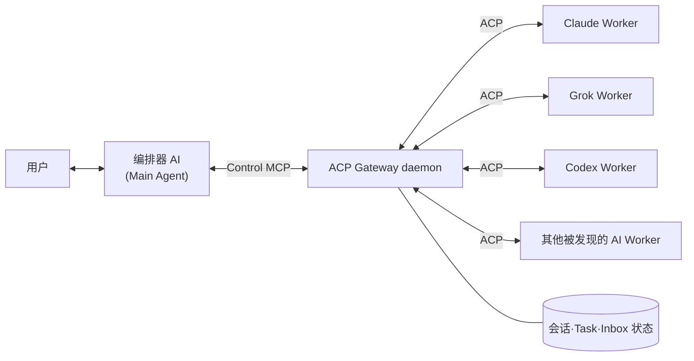

# ACP Gateway

[English](README.md) | [한국어](README.ko.md) | [日本語](README.ja.md) | **简体中文**

**让你正在使用的编码 agent 按需把工作委派给 Claude Code、Codex 和 Grok —— 基于 MCP + ACP，会话持久保持，权限请求可以在对话中交互式审批，无需预先定义任何工作流。**

你是否同时在用多个 AI agent？

向 Claude 提问，再让 Codex 改代码，最后交给 Grok 做 review —— 你是不是一直在终端和对话之间来回切换？

你有没有想过：“要是不用我一个个指挥这些 agent，而是让一个 agent 自己去调用其他 agent 就好了……”？

这个项目就是为这样的你准备的。

## 概述

ACP Gateway 是一个中间件：让你直接对话的 AI —— 即 **编排器（orchestrator）** —— 能够发现本地安装的多个 AI Worker，通过 ACP 运行它们，并管理从长时间任务、权限请求到最终结果回收的全过程。代码和工具说明中使用的 `Main` 指的就是编排器这一角色。

- 内置支持 Claude Code、Codex 和 Grok 作为 Worker；本地安装的其他支持 ACP 的 AI，会与 ACP 官方 registry 比对后被发现。
- daemon 会持续维持 ACP 会话和 provider 进程。
- 即使 MCP 重启，也能恢复 Worker 会话。
- 模型、权限、提问、取消和结果收集均由编排器控制。
- 不会把 Gateway 的控制权限传给 Worker。
- 以本地单用户、单机使用为前提。

## 快速开始

### 环境要求

需要 Node.js 22 或更高版本，以及 macOS 或 Linux。

### 安装

先用 npm 安装 Gateway，再用 bootstrap 把它接入本机的各个 agent：

```bash
npm install -g acp-gateway-daemon
acp-gateway-bootstrap --install-all --refresh-registry --dry-run
acp-gateway-bootstrap --install-all --refresh-registry
```

Claude Worker 使用你已经安装的 Claude CLI：`CLAUDE_CODE_EXECUTABLE` 不为空时用它指定的路径，否则用 daemon 的 PATH 中绝对路径目录里找到的第一个 `claude`（跳过 Gateway 自身依赖中的副本以及 Claude Agent SDK 附带的二进制文件），再没有则用 `~/.local/bin/claude`；都找不到时，Claude 会被报告为未安装。

最后两条命令中，第一条是只确认安装计划的 dry-run，第二条才是真正的安装。`--install-all` 可能会全局安装或更新 ACP 官方 registry 所指定的 `npx`、`uvx` 包，因此请先在 dry-run 的输出中确认目标和版本。Registry manifest 由 ACP 维护，但实际的包和二进制文件是从各提供方的分发渠道下载的。安装会对你的机器做哪些改动，见[安装会对你的机器做哪些改动](#安装会对你的机器做哪些改动)。

默认情况下，`--install-all` 会询问你要把 Codex、Claude、Grok 中的哪一个作为与用户对话的 **front door**（前台入口）。只有你选择的那一个会注册面向编排器的 Control MCP，而所有被发现的 agent 都会安装只读的 Guide MCP 和 skill。非交互式安装默认选择 Codex，也可以像下面这样显式指定。

```bash
acp-gateway-bootstrap --install-all --front-door codex
acp-gateway-bootstrap --install-all --front-door claude
acp-gateway-bootstrap --install-all --front-door grok
```

#### 从源码安装

如果想直接从 Git checkout 运行（比如需要修改代码），就克隆仓库并链接：

```bash
git clone https://github.com/creverse-ai-lab/agent_gateway.git
cd agent_gateway
npm ci
npm link
acp-gateway-bootstrap --install-all --refresh-registry --dry-run
acp-gateway-bootstrap --install-all --refresh-registry
```

执行 `npm link` 后，同样的命令会出现在 PATH 中，并直接从 checkout 运行。最后两条命令以及 front door 的选择与上面完全相同。

### 第一次委派

安装程序会同时在被发现的 AI 上安装 `agent-delegator` skill。这个 skill 会从你的请求中判断 Worker、模型和权限范围，并引导完成从创建 Gateway 会话、传递任务、查看进度、处理提问和权限请求，到回收结果的全过程。安装之后，你不需要记住 MCP 工具的名字，直接用自然语言向编排器提出任务即可。

例如，你可以对正在对话的编排器 AI 这样说：

```text
让 Claude Sonnet 以只读方式审查这个仓库的认证代码，并整理出结果。

让 Grok 4.5 对当前设计做一次 red-team 安全审查，permission 请求请先向我确认。
```

内部按以下顺序运行：

1. 用 `agent_acp_setup` 确认 provider
2. 用 `agent_acp_session_open` 创建 Worker 会话
3. 如有需要，用 `agent_acp_config` 查询、设置 Worker 支持的模型、模式、推理级别等参数
4. 用 `agent_acp_prompt` 传递任务
5. 用 `agent_acp_poll` 查看事件和状态
6. 如有需要，用 `agent_acp_permission` 或 `agent_acp_answer` 作出响应
7. 完成后可以复用会话，或用 `agent_acp_session` 结束

默认提供的 `agent-delegator` 是通用场景的起点。如果你有常用的 Worker、默认模型、权限策略、review 顺序或结果格式，可以按自己的工作方式修改已安装的 skill。`acp-gateway-bootstrap --update` 和普通的 `--update-skill` 不会覆盖你修改过的副本。只有想恢复成已安装的 Gateway 自带的默认版本时，才需要显式执行 `--update-skill --force`。

### 权限策略

打开会话时，从以下策略中选择一个。

| 策略 | 用途 |
|---|---|
| `read_only` | 分析、审查等只读任务 |
| `ask` | 修改文件或执行命令之前，需要编排器批准 |
| `auto_approve` | 在用户允许的会话边界内自动批准 |

Control token、编排器标识符（Main ID）和 Gateway socket 路径都会从 ACP Worker 的环境中移除。同时也会阻止向 Worker 会话重新注入 Control MCP。

### 更新

更新方式取决于 Gateway 是如何安装的。

**通过 npm 安装** — 先安装新版本，再刷新注册信息并重启 daemon：

```bash
npm install -g acp-gateway-daemon@latest
acp-gateway-bootstrap --update
```

对于 npm 安装，`--update` 自身不会运行 Git 或 npm：它会刷新 ACP registry、adapter 和 MCP 注册，并用 npm 安装的版本重启 daemon。npm 上有新版本发布时，Gateway 的 health check 提醒也会告诉你。

**从源码安装** — 只需执行下面这一条命令：

```bash
acp-gateway-bootstrap --update
```

**由应用管理的 runtime** — 如果 Gateway 是由桌面应用安装的（位于 `~/.acp-gateway/runtime/versions/` 下），则由该应用负责更新。此时 `acp-gateway-bootstrap --update` 不会改动 Gateway 的文件，只刷新注册信息。

更新之后，需要重新连接宿主（Claude/Codex/Grok/Auggie）会话，新的工具和参数才会显示出来。具体行为、skill 更新以及重新连接的步骤，请参阅[运维指南](docs/operations.md)（英文）。

## 工作原理



编排器通过 MCP 下达任务，Gateway 通过 ACP 与各个 Worker 通信。Gateway daemon 负责管理 Unix socket、ACP 连接、会话、事件、权限请求以及最小化的恢复状态，因此即使编排器或 MCP 连接重启，也能继续控制正在运行的 Worker。

### 工作流水线

1. **发现与安装** — 安装程序找到本地的 AI，并从 ACP 官方 registry 准备好对应的 agent 和 adapter。
2. **创建任务** — 编排器通过 Control MCP 指定 provider、模型、工作路径和权限策略，打开会话。
3. **运行 Worker** — Gateway 启动对应 provider 的进程，或复用已有的进程和会话。
4. **通过 ACP 传递任务** — prompt、文件操作、tool event 和中间结果都经由 ACP 传递。
5. **处理权限与提问** — Worker 的权限请求或提问经过 Gateway Inbox 转给编排器，编排器的回应再返回给 Worker。
6. **回收与复用结果** — 编排器通过 MCP Task 或 poll 获取状态和结果，必要时可以再次调用或恢复同一个会话。

### 可靠性

Gateway 还会告诉编排器委派出去的工作进展到了哪一步，因此在重启之后或 Worker 长时间没有动静时，编排器无需猜测。

- **会话为何处于当前状态** — 每次状态变化都会记录原因和时间。运行中的 Worker 若一段时间（默认 5 分钟）没有发送任何内容，会被标记为疑似卡住；这只是提示，不会取消任何操作。
- **中断留下了哪些未知** — 因重启或 Worker 丢失而被中断的任务，会说明 Worker 是否可能已经根据 prompt 采取了行动，以及下一步该做什么。`agent_acp_session {action: "check"}` 只读、不启动任何进程，报告会话能否恢复。
- **attention inbox** — `agent_acp_inbox {action: "attention"}` 列出正在等待编排器处理的请求，以及编排器尚未收到的已完成结果；可用 `ack` 将其标记为已读。
- **声明任务之间的关联** — run 可以指明它所跟进的任务（`parentTaskId`）以及使用了其结果的任务（`inputTaskIds`）。指定 `scope: "mine"` 时，会话和任务列表只显示发起调用的编排器自己的工作。
- **多次恢复失败后隔离** — 恢复连续失败（默认 3 次）后，Gateway 不再自动恢复该会话，而是返回 `SESSION_QUARANTINED` 并附上可选的后续操作；显式恢复成功后即解除隔离。

## 什么是 ACP 和 MCP？

[ACP（Agent Client Protocol）](https://agentclientprotocol.com/)是标准化代码编辑器、IDE 与 AI 编码 agent 之间通信的协议。各个编辑器不必再分别集成 Claude、Codex、Grok 这样的 agent，而是通过 ACP 这一通用规范来传递会话创建、prompt、tool 调用、权限请求、进度事件和结果。

在 ACP 规范中，本地 agent 通常以 JSON-RPC over stdio 的方式运行，远程 agent 则可以使用 HTTP 或 WebSocket 连接。**目前 ACP Gateway 的实现范围是：本地单机上的 ACP agent，以及 Unix socket 通信。** 暂不支持连接远程 agent。

- **ACP** 是用来运行 agent 本身、与其对话并管理任务状态的规范。
- **MCP（Model Context Protocol）** 是 AI 连接外部工具、数据和应用的通用接口。
- **ACP Gateway** 在内部通过 ACP 管理 Worker，并以 MCP 工具的形式向编排器提供这些控制能力。

也就是说，这并不是在 MCP 和 ACP 之间二选一。MCP 是编排器操作 Gateway 的入口，ACP 则是 Gateway 与其他 AI agent 实际协作的通信通道。

目前最新的规范是 [MCP 2026-07-28](https://modelcontextprotocol.io/specification/2026-07-28)。ACP Gateway 并不声称实现了这份规范的全部内容，只支持其中以 task handle 启动长时间任务、之后再查询状态和结果的 **MCP Tasks extension 流程**。目前的本地 stdio MCP 服务器没有应用 stateless HTTP core 或 OAuth/OIDC 认证。关于 MCP 2026-07-28 的全部变更，请参阅 [MCP 官方规范](https://modelcontextprotocol.io/specification/2026-07-28)和 [Anthropic 的介绍](https://claude.com/blog/bringing-mcp-2026-07-28-to-claude)。

## 与直接使用 Agent CLI、简单的 MCP 调用有什么不同？

这里的 **直接使用 Agent CLI**，并不是指人在终端之间来回切换操作，而是指你正在对话的编排器通过 shell tool 运行 `claude`、`grok` 之类的其他 AI CLI 进程，并接收 stdout 结果的方式。**简单的 MCP 调用** 则是把这种 CLI 运行封装成一个 MCP tool 的常见 wrapper 方式。

`O` 表示在通常的基本使用流程中就已支持，`X` 表示需要自己另外实现 daemon、会话存储或双向协议。这并不代表 CLI 或 MCP 协议本身在理论上的局限。

| 功能 | 直接使用 Agent CLI | 简单的 MCP wrapper | ACP Gateway | 实际差异 |
|---|:---:|:---:|:---:|---|
| 运行其他 AI | O | O | O | 三种方式都可以调用 Worker |
| 选择 provider·模型 | O | O | O | CLI 使用各 agent 自己的 flag，Gateway 使用统一的输入 |
| 在同一会话中继续反馈 | O | X | O | CLI 需要编排器自己管理 resume ID，Gateway 通过 session ID 管理 |
| 使用 Worker 内置的子 agent | O | O | O | 可以通过 prompt 请求，但 Gateway 还能回收 child event |
| 同时运行多个 Worker | O | O | O | CLI·wrapper 需要编排器自己管理调用关系 |
| 与连接分离的长时间任务 | X | X | O | Gateway 可以通过 MCP Task handle 稍后重新查询 |
| 查询·重放进度 event | X | X | O | Gateway 可以只重新查询 cursor 之后的新 event |
| 响应 Worker 的权限请求 | X | X | O | Gateway 将请求保存在 Inbox 中，并传达编排器的批准·拒绝 |
| 回答 Worker 的中途提问 | X | X | O | 一次性调用很难在同一次运行中作答，Gateway 通过 elicitation 往返 |
| 取消时确认状态直至 Worker 进程 | X | X | O | Gateway 同时管理 ACP cancel 和子进程的终止 |
| 编排器·MCP 重启后重新连接任务 | X | X | O | 独立的 daemon 会保持 Worker 和会话 |
| 无重复的增量结果回收 | X | X | O | 通过 cursor 和 `includeResult` 只回收所需的数据 |
| 自动清理被搁置的会话 | X | X | O | 应用 idle unload 和 retention GC |
| 结构化的故障诊断·恢复状态 | X | X | O | 将 event、task 状态和 checkpoint 分开查看 |

## 安装会对你的机器做哪些改动

安装软件包以及执行 `acp-gateway-bootstrap --install-all` 实际会做的改动如下。加上 `--dry-run` 时，bootstrap 只输出计划，不做任何实际改动。

- **Gateway 软件包（npm 安装）** — `npm install -g` 会把软件包安装到 npm 的全局 prefix 下：文件位于 `$(npm root -g)/acp-gateway-daemon`，`acp-gateway-*` 命令位于 `$(npm prefix -g)/bin`，下面注册的 MCP 服务器也从这里运行。从源码安装时，则由 `npm link` 把 checkout 链接到相同的位置。
- **安装 ACP agent/adapter** — 从 PATH、常见的 CLI 路径和全局 npm 包中查找已安装的 AI，与 ACP 官方 registry 比对，然后全局安装或更新 registry 所指定的 `npx`、`uvx` 包（`npm install --global` 或 `uv tool install --force`）。registry 中没有的 AI 不会被自动注册。
- **注册 MCP** — 通过各 CLI 的 `mcp add` 命令（Auggie 为 `mcp add-json`）注册两个 MCP 服务器。面向编排器的 Control MCP `agent-acp` 只会注册到你选作 front door 的那一个 CLI（`--front-door`；非交互式安装时为 Codex），只读的 Guide MCP `agent-acp-guide` 则会注册到所有被发现的受支持 CLI（Codex、Claude、Grok、Auggie）。注册 Control MCP 时，Control token 和 Main ID 会作为服务器的运行环境变量（`ACP_GATEWAY_CONTROL_TOKEN`、`ACP_GATEWAY_ROOT_ID`）一并传入，所以请只在你信任的本地 agent 上安装 Control MCP。如果已经存在同名但并非由安装程序创建的条目，没有 `--force` 时不会覆盖，而是报错中止。
- **安装 `agent-delegator` skill** — 把 Gateway 自带的 skill 复制到每个被发现的 AI 的 skills 目录。

  | AI | 安装路径 | 用于改变路径的环境变量 |
  |---|---|---|
  | Codex | `~/.codex/skills` | `CODEX_HOME`（设置后为 `$CODEX_HOME/skills`） |
  | Claude | `~/.claude/skills` | `CLAUDE_HOME`（设置后为 `$CLAUDE_HOME/skills`） |
  | Grok | `~/.grok/skills` | `GROK_HOME`（设置后为 `$GROK_HOME/skills`） |
  | Auggie | `~/.augment/skills` | `AUGMENT_HOME`（设置后为 `$AUGMENT_HOME/skills`） |
  | 其他 registry provider | `~/.agents/skills` | 无 |

  如果有多个 provider 使用同一路径，skill 文件只会复制一次。skill 只在首次 `--install-all` 时安装，`--update` 不会碰它。如果已经存在同名但不受安装程序管理的 skill，没有 `--force` 时不会覆盖，而是报错中止。
- **状态文件 `~/.acp-gateway/`** — 会创建以下文件：
  - `install.json`（权限 `0600`）：Control token、Main ID、安装程序所注册的 MCP 和 skill 的记录，以及 ACP agent 自动更新和通知的设置
  - `registry.json`：ACP 官方 registry 的 24 小时缓存
  - `providers.json`：被发现的 provider 的运行定义

  daemon 运行之后，同一目录下还会出现会话状态（`state.snapshot.json`、`state.wal.ndjson`）和 `artifacts` 目录。
- **启动 daemon** — 安装完成后，会通过 health check 启动 Gateway daemon 并确认认证状态；如果正在运行的 daemon 版本不同，则会替换为新版本。可以用 `--skip-health-check` 跳过这一步。

Gateway 本身只会在你主动更新时才改变：npm 安装用 `npm install -g`，源码 checkout 用 `acp-gateway-bootstrap --update`，由应用管理的 runtime 则通过该应用更新。安装程序没有卸载命令，所以如果想还原，需要自行删除上述各项；npm 软件包可以用 `npm uninstall -g acp-gateway-daemon` 删除。

## 文档

- [管理 API 契约](docs/management-api.md)（英文）— 引擎设置、provider 策略、安全关闭以及公开 client 的契约（`acp-gateway-daemon/client`；在应用挂载的 runtime 中为 `acp-gateway/client`）
- [Live use cases](docs/live-usecases.md)（韩文）— 用真实的 Claude、Codex、Grok Worker 跑过的使用案例记录
- [运维指南](docs/operations.md)（英文）— 安装程序选项、更新、宿主重新连接、Worker 参数控制、会话与数据管理
- [变更日志](CHANGELOG.md)（英文）— 各版本的变更

## 许可证

Apache License 2.0 —— 详见 [LICENSE](LICENSE)。

---

Dev by 윤치영
